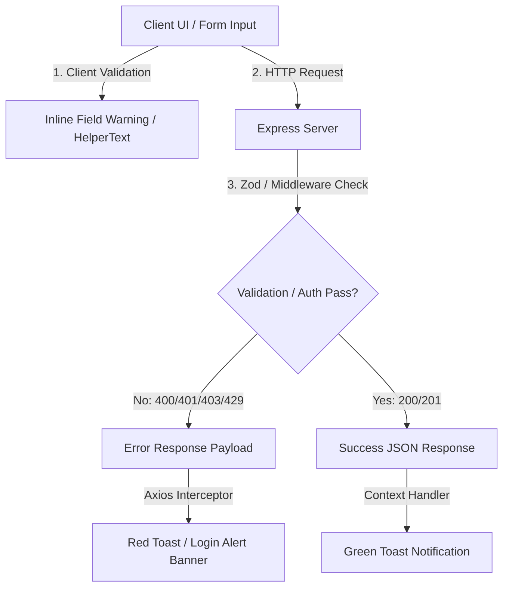

# Hunting Lodge App - Comprehensive Manual Testing Guide

This guide provides an end-to-end, structured manual verification plan for the **Hunting Lodge App**. It incorporates all recent architectural and UX updates across `client/src/` and `server/src/`, establishing concrete, deterministic checkpoints for Happy Path workflows, Validation Edge Cases, SSO/Session scenarios, and Role-Based Access Control (RBAC) visibility.

Every test case follows a strict **GIVEN-WHEN-THEN** flow adhering to intent-driven development standards. All assertions specify exact, deterministic UI outcomes (e.g. specific toast notification messages, color severities, form field helper texts, and HTTP error payloads).

---

## Table of Contents

1. [Test Environment & Setup](#1-test-environment--setup)
   - 1.1 [Prerequisites & Seed Data](#11-prerequisites--seed-data)
   - 1.2 [Application Endpoints](#12-application-endpoints)
   - 1.3 [Architectural Layer & Exception Mapping Model](#13-architectural-layer--exception-mapping-model)
2. [User Personas & Role Matrix](#2-user-personas--role-matrix)
   - 2.1 [Access Control Matrix](#21-access-control-matrix)
   - 2.2 [Dynamic Group Tenancy & Context Switching](#22-dynamic-group-tenancy--context-switching)
3. [Suite 1: SSO, Authentication & Session Management](#3-suite-1-sso-authentication--session-management)
   - 3.1 [Test Case 1.1: SSO Login & First-Time User Auto-Registration (Happy Path)](#test-case-11-sso-login--first-time-user-auto-registration-happy-path)
   - 3.2 [Test Case 1.2: Returning User Login & Claim Refresh (Happy Path)](#test-case-12-returning-user-login--claim-refresh-happy-path)
   - 3.3 [Test Case 1.3: Super Admin Auto-Role Assignment via OIDC Claims (Happy Path)](#test-case-13-super-admin-auto-role-assignment-via-oidc-claims-happy-path)
   - 3.4 [Test Case 1.4: Missing Token Claims & Fallback Resolution (Edge Case)](#test-case-14-missing-token-claims--fallback-resolution-edge-case)
   - 3.5 [Test Case 1.5: Invalid SSO Authorization Code (Edge Case)](#test-case-15-invalid-sso-authorization-code-edge-case)
   - 3.6 [Test Case 1.6: Authentication Rate Limiting - HTTP 429 (Edge Case)](#test-case-16-authentication-rate-limiting---http-429-edge-case)
   - 3.7 [Test Case 1.7: Client In-Flight GET Request Deduplication (Session)](#test-case-17-client-in-flight-get-request-deduplication-session)
   - 3.8 [Test Case 1.8: Global 401 Interceptor & Session Expiry Redirection (Session)](#test-case-18-global-401-interceptor--session-expiry-redirection-session)
   - 3.9 [Test Case 1.9: In-Memory User Cache TTL (30s) & Mid-Session Deactivation (Session)](#test-case-19-in-memory-user-cache-ttl-30s--mid-session-deactivation-session)
   - 3.10 [Test Case 1.10: Expired JWT Token Handling (Session)](#test-case-110-expired-jwt-token-handling-session)
   - 3.11 [Test Case 1.11: Unauthenticated Deep Linking Interception (Session)](#test-case-111-unauthenticated-deep-linking-interception-session)
4. [Suite 2: Role-Based Access Control (RBAC) & Visibility Boundaries](#4-suite-2-role-based-access-control-rbac--visibility-boundaries)
   - 4.1 [Test Case 2.1: Guest User Isolation & Protected Route Interception (Guest)](#test-case-21-guest-user-isolation--protected-route-interception-guest)
   - 4.2 [Test Case 2.2: Standard Member & Non-Manager Admin Published-Only Schedule View (Member/Admin)](#test-case-22-standard-member--non-manager-admin-published-only-schedule-view-memberadmin)
   - 4.3 [Test Case 2.3: Standard Member & Non-Manager Admin Report Deletion Prohibition (Member/Admin)](#test-case-23-standard-member--non-manager-admin-report-deletion-prohibition-memberadmin)
   - 4.4 [Test Case 2.4: Shift Manager UI Badge & Group Settings Access (Manager)](#test-case-24-shift-manager-ui-badge--group-settings-access-manager)
   - 4.5 [Test Case 2.5: Shift Manager Schedule Edit & Draft Save (Manager)](#test-case-25-shift-manager-schedule-edit--draft-save-manager)
   - 4.6 [Test Case 2.6: Shift Schedule Publishing & Vacation Day Deduction (Manager)](#test-case-26-shift-schedule-publishing--vacation-day-deduction-manager)
   - 4.7 [Test Case 2.7: Shift Manager Group Tenancy Boundary Check (Manager)](#test-case-27-shift-manager-group-tenancy-boundary-check-manager)
   - 4.8 [Test Case 2.8: Administrator Navbar Badging & Dynamic Group Switching (Admin)](#test-case-28-administrator-navbar-badging--dynamic-group-switching-admin)
   - 4.9 [Test Case 2.9: Administrator Self-Deletion Prevention (Security Invariant)](#test-case-29-administrator-self-deletion-prevention-security-invariant)
   - 4.10 [Test Case 2.10: Root Super Admin Account Protection Locks (Security Invariant)](#test-case-210-root-super-admin-account-protection-locks-security-invariant)
   - 4.11 [Test Case 2.11: Protected System Group Lifecycle Locks (Security Invariant)](#test-case-211-protected-system-group-lifecycle-locks-security-invariant)
5. [Suite 3: Happy Path End-to-End Operational Workflows](#5-suite-3-happy-path-end-to-end-operational-workflows)
   - 5.1 [Test Case 3.1: Sites & Bookmarks Management (CRUD, Tags & Favorites)](#test-case-31-sites--bookmarks-management-crud-tags--favorites)
   - 5.2 [Test Case 3.2: Phone Directory Management (CRUD, Formatting & Details Modal)](#test-case-32-phone-directory-management-crud-formatting--details-modal)
   - 5.3 [Test Case 3.3: Shift Schedule Viewer (Navigation, Fullscreen & Responsive Matrix)](#test-case-33-shift-schedule-viewer-navigation-fullscreen--responsive-matrix)
   - 5.4 [Test Case 3.4: Shift Reports Management (Auto-Detection, Tiptap Editor & Attendees)](#test-case-34-shift-reports-management-auto-detection-tiptap-editor--attendees)
   - 5.5 [Test Case 3.5: Group Settings Configuration (Shift Types, Time Slots & Reordering)](#test-case-35-group-settings-configuration-shift-types-time-slots--reordering)
   - 5.6 [Test Case 3.6: Admin User & Group Oversight (CRUD, Roles & Live Population)](#test-case-36-admin-user--group-oversight-crud-roles--live-population)
   - 5.7 [Test Case 3.7: About & Support Dialog (Dynamic Vite Version & Support Hotline)](#test-case-37-about--support-dialog-dynamic-vite-version--support-hotline)
6. [Suite 4: Validation Edge Cases & Server Exception Mappings](#6-suite-4-validation-edge-cases--server-exception-mappings)
   - 6.1 [Exception-to-Toast/Warning Mapping Matrix](#61-exception-to-toastwarning-mapping-matrix)
   - 6.2 [Test Case 4.1: Sites Form Field Required Validations (Client-Side)](#test-case-41-sites-form-field-required-validations-client-side)
   - 6.3 [Test Case 4.2: Phone Directory Multi-Number & Type Formatting (Client-Side)](#test-case-42-phone-directory-multi-number--type-formatting-client-side)
   - 6.4 [Test Case 4.3: Member Vacation Balance Negative Boundary (API Validation)](#test-case-43-member-vacation-balance-negative-boundary-api-validation)
   - 6.5 [Test Case 4.4: User Reordering Malformed Payload (API Zod Validation)](#test-case-44-user-reordering-要因-payload-api-zod-validation)
   - 6.6 [Test Case 4.5: Locked Shift Report Modification Invariant (`REPORT_LOCKED`)](#test-case-45-locked-shift-report-modification-invariant-report_locked)
   - 6.7 [Test Case 4.6: Deleting Group with Active Members Guard](#test-case-46-deleting-group-with-active-members-guard)
7. [Suite 5: Cross-Cutting & System-Wide Checks](#7-suite-5-cross-cutting--system-wide-checks)
   - 7.1 [Test Case 5.1: Light & Dark Mode Contrast Verification](#test-case-51-light--dark-mode-contrast-verification)
   - 7.2 [Test Case 5.2: Responsive Viewport Breakpoints (Mobile, Tablet, Desktop)](#test-case-52-responsive-viewport-breakpoints-mobile-tablet-desktop)
   - 7.3 [Test Case 5.3: Global Toast Notification System Auto-Dismiss Timers](#test-case-53-global-toast-notification-system-auto-dismiss-timers)
   - 7.4 [Test Case 5.4: Custom 404 Route Fallback](#test-case-54-custom-404-route-fallback)
8. [Test Execution & Sign-Off Checklist](#8-test-execution--sign-off-checklist)

---

## 1. Test Environment & Setup

### 1.1 Prerequisites & Seed Data

Ensure application dependencies are installed, local databases are active, and sample test fixtures are loaded.

```bash
# In project root:
npm run dev:seed
```

> [!NOTE]
> Seeding the database resets collections and creates deterministic test records:
>
> - **Super Admin Account:** `username: "10001"` (Display: `Admin User`, Email: `admin@dev.local`, Groups: `hunting_lodge_admin` [Manager], `noc` [Manager])
> - **Regular Member Account:** `username: "10002"` (Display: `Regular User`, Email: `member@dev.local`, Groups: `noc` [Member])
> - **Core Groups:** `hunting_lodge_admin` (System Protected), `noc` (Operational Group)
> - **Mock Data:** Initial site bookmarks, phone contacts, shift types (`בוקר`, `ערב`, `לילה`, `חופש`), time slots, schedules, and historical reports.

### 1.2 Application Endpoints

- **Client Application:** `http://localhost:5173` (Vite dev server)
- **Backend REST API:** `http://localhost:5000` (or `PORT` from `.env`)
- **API Health / Status:** `http://localhost:5000/api/auth/me`

### 1.3 Architectural Layer & Exception Mapping Model

The application enforces a 4-tier validation and notification boundary:



- **Client Form Level:** Immediate field border highlights and red `helperText` (e.g. `"Name is required"`).
- **Zod Schema Level (`400 Bad Request`):** Handled by `validateRequest` in `validationMiddleware.ts` yielding `code: "VALIDATION_ERROR"`.
- **RBAC Security Level (`403 Forbidden`):** Handled by `authMiddleware.ts`(`FORBIDDEN_ADMIN_REQUIRED`, `FORBIDDEN_GROUP_MEMBER_REQUIRED`, `FORBIDDEN_SHIFT_MANAGER_REQUIRED`, `FORBIDDEN_SELF_DELETION`, `FORBIDDEN_SUPER_ADMIN_PROTECTED`).
- **Global Toast Level:** Rendered via `NotificationContext.tsx` anchored at bottom-right (`variant="filled"`).

---

## 2. User Personas & Role Matrix

### 2.1 Access Control Matrix

| Route / Capability                     |    Unauthenticated    | Guest (`groups: []`)  | Regular Member (`member`) | Shift Manager (`shift_manager`) | System Administrator (`hunting_lodge_admin`) |
| :------------------------------------- | :-------------------: | :-------------------: | :-----------------------: | :-----------------------------: | :------------------------------------------: |
| **Login (`/login`)**                   |     ✅ Accessible     |   🔄 Redirects `/`    |     🔄 Redirects `/`      |        🔄 Redirects `/`         |               🔄 Redirects `/`               |
| **Guest Screen (`/guest`)**            | 🔄 Redirects `/login` |       ✅ Landed       |     🔄 Redirects `/`      |        🔄 Redirects `/`         |               🔄 Redirects `/`               |
| **Global Navbar**                      |       ❌ Hidden       |       ❌ Hidden       |        ✅ Visible         |     ✅ Visible (+Dot Badge)     |         ✅ Visible (+Admin Controls)         |
| **Sites (`/`)**                        | ⛔ Redirects `/login` | ⛔ Redirects `/guest` |      ✅ Full Access       |         ✅ Full Access          |                ✅ Full Access                |
| **Phone Directory (`/phones`)**        | ⛔ Redirects `/login` | ⛔ Redirects `/guest` |      ✅ Full Access       |         ✅ Full Access          |                ✅ Full Access                |
| **Shift Schedule (`/schedule`)**       | ⛔ Redirects `/login` | ⛔ Redirects `/guest` |     👁️ Published Only     |    ✏️ Create, Edit, Publish     |      👁️ Published Only* (Unless Manager)    |
| **Shift Reports (`/reports`)**         | ⛔ Redirects `/login` | ⛔ Redirects `/guest` |   👁️ View & Create/Edit   |     🗑️ Create, Edit, Delete     |      👁️ View & Create/Edit* (No Delete)     |
| **Group Settings (`/group-settings`)** | ⛔ Redirects `/login` | ⛔ Redirects `/guest` |  ⛔ Access Denied (`/`)   |      ✅ Full Config Access      |     ✅ Full Config Access (When Manager)     |
| **Admin Dashboard (`/admin/users`)**   | ⛔ Redirects `/login` | ⛔ Redirects `/guest` |  ⛔ Access Denied (`/`)   |     ⛔ Access Denied (`/`)      |      ✅ Full CRUD (When in Admin Group)      |

> [!IMPORTANT]
> **Administrative Scope Invariant for Shift Schedule & Reports:**
> - **Shift Schedule (`/schedule`):** An administrator user has **"Published Only"** rights on the shift schedule page. Only a user holding explicit manager rights (`role: "shift_manager"`) for that specific group can create, edit, save drafts, or publish schedules (`saveSchedule` and `publishSchedule` in `schedulesController.ts`).
> - **Shift Reports (`/reports`):** An administrator user has **"View & Create/Edit"** rights on the shift reports page (equivalent to standard member tier). Only a user holding explicit manager rights (`role: "shift_manager"`) for that specific group has rights to delete shift reports (`deleteReport` in `reportsController.ts`).

### 2.2 Dynamic Group Tenancy & Context Switching

Permissions in `UserContext.tsx` and server authorization middleware are dynamically scoped to the **Active Group Context**:

1. **Administrative Elevation:** A user only receives `isAdmin: true` when their active group in the Navbar is set to `hunting_lodge_admin`. When switching to an operational group such as `noc`, system administrative privileges do not grant operational manager rights.
2. **Shift Schedule Guard:** System Administrators have **Published Only** access on `/schedule`. Only a user explicitly assigned `role: "shift_manager"` in the active group can create, edit, save drafts, or publish schedules (`saveSchedule` and `publishSchedule` in `schedulesController.ts`).
3. **Shift Reports Guard:** System Administrators have **View & Create/Edit** access on `/reports`. Only a user explicitly assigned `role: "shift_manager"` in the active group can delete shift reports (`deleteReport` in `reportsController.ts`).
4. **Managerial Tenancy:** A user only receives `isShiftManager: true` if their membership for the **currently active group** has `role: "shift_manager"`.
5. **Data Isolation:** Standard users querying `/api/users?groupId=...` receive only peers within their active group. Direct requests to `/api/users` without `groupId` are strictly reserved for Administrators.

---

## 3. Suite 1: SSO, Authentication & Session Management

### Test Case 1.1: SSO Login & First-Time User Auto-Registration (Happy Path)

- **Objective:** Verify that a new user logging in via OpenID Connect (OIDC) is automatically provisioned in the database and issued a valid session.
- **Preconditions:** User exists in the mock SSO IdP (`username: "new_cadet"`, `email: "cadet@dev.local"`) but does not exist in the app database.
- **GIVEN:** Browser is at `http://localhost:5173/login` in Incognito mode with no active session tokens.
- **WHEN:** User clicks **"Login with Organization SSO"** and authenticates through the IdP callback to `/auth/callback?code=mock_valid_code`.
- **THEN:**
  1. Frontend displays `ThinkingLoader.tsx` while `loginWithCode` in `authApi.ts` posts to `/api/auth/login`.
  2. Server creates a new document in `User.ts` with `username: "new_cadet"`, `isActive: true`, `groups: []`, and returns a signed JWT.
  3. Client stores `hunting_token` and `hunting_userId` in `localStorage`.
  4. User is redirected to `/guest` because `groups` is empty.
- **Must Not:** Crash or create duplicate users on consecutive requests.
- **Failure Consequence:** New personnel cannot enter the platform.

---

### Test Case 1.2: Returning User Login & Claim Refresh (Happy Path)

- **Objective:** Verify returning users have their `lastLogin` timestamp and claims updated upon subsequent logins.
- **Preconditions:** User `10002` already exists in MongoDB.
- **GIVEN:** User `10002` initiates SSO callback via `/auth/callback?code=mock_user_code`.
- **WHEN:** Server executes `login` in `authController.ts`.
- **THEN:**
  1. Server updates `lastLogin` ISO timestamp on the user record.
  2. Server returns existing user profile and signed JWT.
  3. Client redirects to `/` and renders the Sites dashboard with the active group `noc`.
- **Must Not:** Overwrite custom user configurations or reset vacation balances.
- **Failure Consequence:** Loss of member group assignments or historical statistics.

---

### Test Case 1.3: Super Admin Auto-Role Assignment via OIDC Claims (Happy Path)

- **Objective:** Verify that incoming SSO token claims with administrative groups automatically link the account to the system admin group.
- **Preconditions:** SSO user provides claim `groups: ["ADMINISTRATORS"]` or matches `config.superAdmin.groupName`.
- **GIVEN:** Unassigned or new user logs in via SSO.
- **WHEN:** Token claims contain the administrative role.
- **THEN:**
  1. `authController.ts` dynamically adds an entry to `user.groups` with `groupId: hunting_lodge_admin` and `role: "shift_manager"`.
  2. The admin group document adds the user `_id` to its `members` array.
  3. Client lands on `/` with red avatar badge and red **"Users & Groups"** navigation button visible.
- **Must Not:** Require manual database intervention to grant administrative onboarding.
- **Failure Consequence:** System administrators locked out of fresh environments.

---

### Test Case 1.4: Missing Token Claims & Fallback Resolution (Edge Case)

- **Objective:** Verify graceful handling when the SSO identity provider returns incomplete token claims (e.g. missing `preferred_username` or `email`).
- **Preconditions:** IdP returns claims containing only `sub: "auth0|998877"` and `nickname: "cadet99"`.
- **GIVEN:** Callback is triggered with the degraded token payload.
- **WHEN:** `authController.ts` parses claims.
- **THEN:**
  1. Fallback chain selects `nickname` or `sub` as `dbUsername`.
  2. Synthetic internal email format is assigned: `cadet99@organization.local`.
  3. Registration succeeds without HTTP 500 error.
- **Must Not:** Fail with unhandled rejection or insert empty username strings into the database.
- **Failure Consequence:** SSO authentication crashes when external identity schemas differ.

---

### Test Case 1.5: Invalid SSO Authorization Code (Edge Case)

- **Objective:** Verify deterministic error notification when the SSO authorization code exchange fails or is rejected.
- **Preconditions:** Browser receives an invalid, tampered, or expired authorization code `code=invalid_xyz`.
- **GIVEN:** User visits `http://localhost:5173/auth/callback?code=invalid_xyz`.
- **WHEN:** Client submits the code to `POST /api/auth/login`.
- **THEN:**
  1. Server rejects with HTTP 401:
     ```json
     {
       "message": "SSO Authentication failed",
       "error": "Invalid authorization code or provider error"
     }
     ```
  2. `SSOCallback.tsx` redirects to `http://localhost:5173/login?error=sso_failed`.
  3. `LoginFeedback.tsx` renders a red alert banner above the login button:
     ```text
     "Authentication failed. Please try again."
     ```
- **Must Not:** Leave the application in an infinite loading spinner loop.
- **Failure Consequence:** Confusing white screen or stuck loader on auth failure.

---

### Test Case 1.6: Authentication Rate Limiting - HTTP 429 (Edge Case)

- **Objective:** Verify that brute-force requests to `/api/auth/sso-url` or `/api/auth/login` trigger the rate limiter.
- **Preconditions:** Backend rate limiter configured with max 50 requests per 15-minute window.
- **GIVEN:** A client makes 51 rapid requests to `/api/auth/sso-url` within 1 minute.
- **WHEN:** The 51st request hits the server.
- **THEN:**
  1. Server returns HTTP 429 Too Many Requests:
     ```json
     {
       "message": "Too many authentication attempts, please try again after 15 minutes",
       "code": "RATE_LIMIT_EXCEEDED"
     }
     ```
  2. Client catches the error and displays a red Toast notification:
     ```text
     "Failed to connect to SSO server. Please check your connection or contact support."
     ```
- **Must Not:** Degrade or crash the Node.js event loop.
- **Failure Consequence:** Vulnerability to DoS or brute-force code enumeration.

---

### Test Case 1.7: Client In-Flight GET Request Deduplication (Session)

- **Objective:** Verify that rapid concurrent GET requests to the same endpoint are deduplicated to reduce server load.
- **Preconditions:** Client is authenticated and components mount simultaneously.
- **GIVEN:** Two components fire `getPhones()` in `phonesApi.ts` at the exact same millisecond.
- **WHEN:** `apiClient.ts` processes the outgoing calls.
- **THEN:**
  1. `inFlightRequests` Map captures the first promise and reuses it for the second call.
  2. Only 1 physical HTTP request is recorded in DevTools Network tab.
  3. Both components resolve with the identical response data.
- **Must Not:** Return stale data on subsequent user-initiated button refreshes.
- **Failure Consequence:** Network request storms and UI race conditions.

---

### Test Case 1.8: Global 401 Interceptor & Session Expiry Redirection (Session)

- **Objective:** Verify that any authenticated API call returning HTTP 401 immediately purges local session tokens and redirects to the login screen with an alert.
- **Preconditions:** User is logged in with `hunting_token` stored in `localStorage`.
- **GIVEN:** User is browsing `http://localhost:5173/phones`.
- **WHEN:** A background request returns HTTP 401 (e.g. forced revocation or invalidated secret).
- **THEN:**
  1. `apiClient.ts` response interceptor purges `hunting_token`, `hunting_userId`, and `hunting_groupId`.
  2. Browser redirects to `http://localhost:5173/login?error=session_expired`.
  3. Login page displays a red alert banner:
     ```text
     "Authentication failed. Please try again."
     ```
- **Must Not:** Retain broken JWTs in `localStorage` or loop repeatedly.
- **Failure Consequence:** Stale tokens causing broken, unresponsive UI states.

---

### Test Case 1.9: In-Memory User Cache TTL (30s) & Mid-Session Deactivation (Session)

- **Objective:** Verify that the server's in-memory session cache maintains a 30-second TTL and revokes access when an account is marked inactive.
- **Preconditions:** User `10002` is actively logged in.
- **GIVEN:** User `10002` is authenticated with active cache entry in `authMiddleware.ts`.
- **WHEN:** Admin sets `isActive: false` on `10002` directly in the database.
- **THEN:**
  1. Within 0-29 seconds: Immediate requests may succeed via the cached session.
  2. After 30 seconds: The cache entry expires. The next request queries MongoDB, detects `isActive === false`, purges the cache, and returns HTTP 401:
     ```json
     {
       "message": "Unauthorized: User not found or inactive",
       "code": "USER_INACTIVE"
     }
     ```
  3. Client catches the 401 and forces redirect to `/login?error=session_expired`.
- **Must Not:** Allow deactivated users to indefinitely perform read/write actions.
- **Failure Consequence:** Deactivated personnel retaining active system access.

---

### Test Case 1.10: Expired JWT Token Handling (Session)

- **Objective:** Verify that expired cryptographic tokens are rejected deterministically.
- **Preconditions:** Client holds a token with `exp` in the past.
- **GIVEN:** Request is dispatched with expired Bearer token in the `Authorization` header.
- **WHEN:** `authMiddleware.ts` executes `jwt.verify` in `jwt.ts`.
- **THEN:**
  1. Verification throws `TokenExpiredError`.
  2. Middleware responds with HTTP 401:
     ```json
     {
       "message": "Unauthorized: Token expired",
       "code": "TOKEN_EXPIRED"
     }
     ```
  3. Client redirects to `/login?error=session_expired`.
- **Must Not:** Leak internal stack traces or cryptographic keys in the response.
- **Failure Consequence:** Security vulnerability or unexpected crash.

---

### Test Case 1.11: Unauthenticated Deep Linking Interception (Session)

- **Objective:** Verify unauthenticated users attempting to access protected deep routes are blocked and redirected.
- **Preconditions:** Clear all cookies and `localStorage` keys in an Incognito window.
- **GIVEN:** Browser address bar is set directly to `http://localhost:5173/group-settings`.
- **WHEN:** User presses Enter.
- **THEN:**
  1. `App.tsx` detects `user === null` and `token === null`.
  2. Route redirects immediately to `/login`.
  3. Top navigation bar is completely hidden.
- **Must Not:** Flash protected group configuration data prior to redirecting.
- **Failure Consequence:** Unauthorized data exposure during initial render.

---

## 4. Suite 2: Role-Based Access Control (RBAC) & Visibility Boundaries

### Test Case 2.1: Guest User Isolation & Protected Route Interception (Guest)

- **Objective:** Verify users with 0 assigned groups are confined strictly to `/guest` and cannot access operational tools.
- **Preconditions:** Log in with an account having `groups: []`.
- **GIVEN:** User is authenticated but unassigned to any operational unit.
- **WHEN:** User manually enters `http://localhost:5173/schedule` in the browser address bar.
- **THEN:**
  1. Application intercepts navigation and redirects back to `http://localhost:5173/guest`.
  2. Navbar remains completely hidden.
  3. Screen displays the large lock icon, `"Welcome, [Username]"`, and the warning box:
     ```text
     "Pending Approval - You are not assigned to any group yet. Please contact your System Administrator or Team Leader to assign you permissions."
     ```
  4. Clicking **"Logout & Try Again"** clears tokens and returns to `/login`.
- **Must Not:** Render sidebar links, sites, or phone numbers.
- **Failure Consequence:** Unvetted users viewing sensitive operational schedules.

---

### Test Case 2.2: Standard Member & Non-Manager Admin Published-Only Schedule View (Member/Admin)

- **Objective:** Verify regular group members and System Administrators without explicit Shift Manager assignment can only view published schedules and cannot create, edit, save, or publish schedules.
- **Preconditions:**
  - Case A (Regular Member): Log in as `10002` (Regular Member in `noc`).
  - Case B (System Administrator): Log in as System Administrator `10001` switched to an operational group where they are NOT assigned `role: "shift_manager"`.
- **GIVEN:** User navigates to `http://localhost:5173/schedule`.
- **WHEN:** User inspects the schedule interface.
- **THEN:**
  1. Shifts for the published week render with assigned member names and color-coded shift blocks.
  2. Clicking on any schedule grid cell does **NOT** open a shift selector popover (cells are inert; guarded by `isShiftManager` in `ScheduleTable.tsx`).
  3. **"Save Changes"** (floppy disk) button is **NOT** present in the DOM (`isShiftManager` check in `ShiftSchedulePage.tsx`).
  4. **"Publish Schedule"** button is **NOT** present in the DOM (`isShiftManager` check in `ShiftSchedulePage.tsx`).
  5. Direct API dispatch of `PUT /api/schedules` or saving/publishing endpoints returns HTTP 403:
     ```json
     {
       "message": "Forbidden: You must be an explicit Shift Manager of this group to save schedules.",
       "code": "FORBIDDEN_SHIFT_MANAGER_REQUIRED"
     }
     ```
- **Must Not:** Allow regular members or administrators without explicit group manager role to edit, save drafts, or publish schedules.
- **Failure Consequence:** Unauthorized tampering with operational duty rosters by non-manager personnel.

---

### Test Case 2.3: Standard Member & Non-Manager Admin Report Deletion Prohibition (Member/Admin)

- **Objective:** Verify regular members and System Administrators without explicit Shift Manager assignment can view, create, and edit shift reports, but are strictly blocked from deleting reports.
- **Preconditions:**
  - Case A (Regular Member): Log in as `10002` on `http://localhost:5173/reports`.
  - Case B (System Administrator): Log in as System Administrator `10001` switched to an operational group where they do not hold `role: "shift_manager"`.
- **GIVEN:** User selects an existing shift report from the archive sidebar.
- **WHEN:** User inspects the report action buttons at the bottom of the form.
- **THEN:**
  1. The green **"Save Report"** and gray **"Discard Changes"** buttons are visible (user has View & Create/Edit rights).
  2. The red **"Delete Report"** button is **NOT** rendered in the UI (`handleDeleteReport` in `ShiftReportPage.tsx` guarded strictly by `isShiftManager`).
  3. Dispatching an HTTP `DELETE /api/reports/:id` via console/Postman returns HTTP 403:
     ```json
     {
       "message": "Forbidden: Only an explicit Shift Manager of this group can delete reports.",
       "code": "FORBIDDEN_SHIFT_MANAGER_REQUIRED"
     }
     ```
- **Must Not:** Allow deletion of shift reports by anyone other than an explicit Shift Manager of that group.
- **Failure Consequence:** Accidental or unauthorized deletion of operational shift audit records.

---

### Test Case 2.4: Shift Manager UI Badge & Group Settings Access (Manager)

- **Objective:** Verify users assigned `role: "shift_manager"` receive manager indicators and configuration access.
- **Preconditions:** Log in as `10001` with active group set to `noc` (where user holds manager role).
- **GIVEN:** User views the top Navigation Bar.
- **WHEN:** Inspecting header controls.
- **THEN:**
  1. User Avatar displays a small dot/badge.
  2. Clicking User Avatar displays the group list with `(M)` next to `noc`.
  3. **Group Settings** gear icon button is visible in the Navbar.
  4. Clicking the gear icon successfully navigates to `http://localhost:5173/group-settings`.
- **Must Not:** Render the administrative Users & Groups button unless actively in `hunting_lodge_admin`.
- **Failure Consequence:** Confusion between group management and system administration.

---

### Test Case 2.5: Shift Manager Schedule Edit & Draft Save (Manager)

- **Objective:** Verify Shift Managers can assign shifts, clear cells, and persist draft schedules.
- **Preconditions:** Log in as Manager (`10001` in `noc`).
- **GIVEN:** User is at `http://localhost:5173/schedule`.
- **WHEN:**
  1. Manager clicks an empty cell for a user on Tuesday.
  2. Popover menu opens displaying configured shift types (`בוקר`, `ערב`, `לילה`, `חופש`).
  3. Manager selects `משמרת בוקר`.
  4. Cell updates with morning shift color and title.
  5. Manager clicks **"Save Changes"** icon button in the header toolbar.
- **THEN:**
  1. Client sends `PUT /api/schedules/:id` with draft assignment payload.
  2. A green Toast notification appears:
     ```text
     "Schedule saved as Draft"
     ```
  3. Status badge displays `"Draft"` (or `"Published"` if editing a live schedule).
  4. Page reload confirms the assignment persists.
- **Must Not:** Deduct vacation balances while the schedule is merely saved as Draft.
- **Failure Consequence:** Premature deduction of leave days before schedules are confirmed.

---

### Test Case 2.6: Shift Schedule Publishing & Vacation Day Deduction (Manager)

- **Objective:** Verify publishing a schedule prompts for confirmation, triggers vacation balance deductions, and locks in the roster.
- **Preconditions:** Manager has configured at least one member with a `חופש` (Vacation) shift in the draft schedule.
- **GIVEN:** Schedule has unsaved or draft changes.
- **WHEN:** Manager clicks **"Publish Schedule"**.
- **THEN:**
  1. `ConfirmDialog.tsx` opens warning: `"Are you sure you want to publish? This will update member vacation balances."`
  2. Manager clicks **"Confirm"**.
  3. Client dispatches publish request.
  4. Green Toast notification displays:
     ```text
     "Schedule Published Successfully!"
     ```
  5. Status badge switches to `"Published"`.
  6. In Group Settings -> Members Tab, verify the member's vacation balance decreased by 1 day per vacation shift.
- **Must Not:** Allow double-deductions if the publish button is clicked repeatedly.
- **Failure Consequence:** Erroneous leave balance calculations and HR disputes.

---

### Test Case 2.7: Shift Manager Group Tenancy Boundary Check (Manager)

- **Objective:** Verify a Shift Manager of Group A cannot modify schedules, settings, or members of Group B.
- **Preconditions:** Manager is assigned `shift_manager` in `noc`, but is NOT a manager of `cyber_ops`.
- **GIVEN:** Authenticated session for Manager of `noc`.
- **WHEN:** Manager attempts to call `PUT /api/users/reorder/group` with `groupId: "cyber_ops_id"`.
- **THEN:**
  1. Server `usersController.ts` checks tenancy via `isShiftManager` in `authHelpers.ts`.
  2. Request is rejected with HTTP 403 Forbidden:
     ```json
     {
       "message": "Forbidden: Administrator or Shift Manager permissions required for this group.",
       "code": "FORBIDDEN_MANAGER_REQUIRED"
     }
     ```
  3. Client UI displays red Toast: `"Failed to update order"`.
- **Must Not:** Permit cross-departmental configuration leakage.
- **Failure Consequence:** Breach of organizational boundary separation.

---

### Test Case 2.8: Administrator Navbar Badging & Dynamic Group Switching (Admin)

- **Objective:** Verify Super Administrators receive system-level indicators, can seamlessly switch between administrative and operational groups, and correctly inherit group-level role restrictions on schedules and reports.
- **Preconditions:** Log in as Super Admin `10001`.
- **GIVEN:** Active group is `hunting_lodge_admin`.
- **WHEN:** Inspecting Navbar and switching groups.
- **THEN:**
  1. User avatar has red background (`error.main`).
  2. Red **"Users & Groups"** button is visible in the Navbar.
  3. Clicking User Avatar -> Switch Group -> select an operational group (e.g. `noc`).
  4. URL updates to `/`. Red **"Users & Groups"** button disappears.
  5. Avatar background switches back to default theme color.
  6. Navigate to `/schedule`: System Administrator has **Published Only** rights (cells are inert; Save Changes and Publish Schedule buttons are hidden) unless explicitly assigned `role: "shift_manager"` for that group.
  7. Navigate to `/reports`: System Administrator has **View & Create/Edit** rights, but the red **"Delete Report"** button remains hidden unless explicitly assigned `role: "shift_manager"` for that group.
- **Must Not:** Retain full administrative CRUD or bypass group Shift Manager requirements on `/schedule` and `/reports`.
- **Failure Consequence:** Accidental global mutations or unauthorized schedule/report actions outside manager boundaries.

---

### Test Case 2.9: Administrator Self-Deletion Prevention (Security Invariant)

- **Objective:** Verify that administrators cannot delete their own account through the UI or via direct API calls.
- **Preconditions:** Logged in as Admin `10001` on `http://localhost:5173/admin/users`.
- **GIVEN:** Users table is displayed on the Admin page.
- **WHEN:** Locating the row corresponding to `10001` (Admin User).
- **THEN:**
  1. The Delete (trash) icon button is **COMPLETELY HIDDEN** for the currently authenticated row (`AdminTable.tsx` check: `!isCurrentUser`).
  2. If the admin attempts a manual HTTP `DELETE /api/users/10001_id`, the server rejects with HTTP 403:
     ```json
     {
       "message": "Forbidden: Administrators cannot delete their own accounts.",
       "code": "FORBIDDEN_SELF_DELETION"
     }
     ```
- **Must Not:** Allow system lock-out through accidental self-destruction.
- **Failure Consequence:** Orphaned database with zero accessible administrators.

---

### Test Case 2.10: Root Super Admin Account Protection Locks (Security Invariant)

- **Objective:** Verify that the primary root Super Admin account cannot be deactivated or deleted by any other administrator.
- **Preconditions:** Secondary admin is logged in, viewing Super Admin `10001` in `/admin/users`.
- **GIVEN:** Admin opens the edit dialog for `10001`.
- **WHEN:** Inspecting the security locks in `AdminDialogs.tsx`.
- **THEN:**
  1. An alert banner appears: `"Super Administrator - Core system account. Some restrictions apply."`
  2. The **Active User** switch is permanently **DISABLED**.
  3. Username textfield is disabled with helperText: `"User ID is managed via SSO and cannot be modified."`
  4. If an HTTP `PUT /api/users/:id` is sent with `{ "isActive": false }`, server returns HTTP 403:
     ```json
     {
       "message": "System Security: The root Super Admin account cannot be deactivated.",
       "code": "FORBIDDEN_SUPER_ADMIN_PROTECTED"
     }
     ```
  5. In `AdminTable.tsx`, the Delete icon button is completely hidden (`!isSuperAdmin`).
- **Must Not:** Allow rogue or compromised admin accounts to disable root recovery access.
- **Failure Consequence:** Permanent denial of service for primary administration.

---

### Test Case 2.11: Protected System Group Lifecycle Locks (Security Invariant)

- **Objective:** Verify the root administrative group (`hunting_lodge_admin`) cannot be renamed or deleted.
- **Preconditions:** Viewing Groups tab in `http://localhost:5173/admin/users`.
- **GIVEN:** Table displays `hunting_lodge_admin`.
- **WHEN:**
  1. Check actions column for `hunting_lodge_admin`: Delete icon button is **NOT RENDERED** (`!isSystemGroup`).
  2. Click Edit icon for `hunting_lodge_admin`.
- **THEN:**
  1. Group Name field is disabled with helper text:
     ```text
     "System groups cannot be renamed"
     ```
  2. The member count reflects all assigned admins.
- **Must Not:** Allow deletion or rename of system security anchoring groups.
- **Failure Consequence:** Inability of auth middleware to resolve administrative privilege.

---

## 5. Suite 3: Happy Path End-to-End Operational Workflows

### Test Case 3.1: Sites & Bookmarks Management (CRUD, Tags & Favorites)

- **Objective:** Verify complete lifecycle of site bookmarks, tag filtering, and real-time sorting.
- **Preconditions:** Authenticated as Member or Manager in `noc`.
- **GIVEN:** User is at `http://localhost:5173/` (Sites).
- **WHEN:**
  1. Click **"+ Add Site"**.
  2. Enter Title: `Monitoring Portal`, URL: `https://monitor.dev.local`, Description: `Real-time telemetry`, Tag: `General`.
  3. Click **"Create Site"**.
  4. Click star icon on the new card.
  5. Toggle favorites filter dropdown to "Favorites".
  6. Click edit icon on card, update Title to `NOC Telemetry`, click **"Save Changes"**.
  7. Click trash icon, confirm in `ConfirmDialog.tsx`.
- **THEN:**
  1. Creation triggers green Toast: `"New site created successfully"`.
  2. Star icon immediately toggles and card appears in Favorites view.
  3. Update triggers green Toast: `"Site updated successfully"`.
  4. Deletion triggers green Toast: `"Site deleted successfully"`, card disappears.
- **Must Not:** Leave orphaned favorite references in user documents.
- **Failure Consequence:** Broken bookmarks and cluttered team landing pages.

---

### Test Case 3.2: Phone Directory Management (CRUD, Formatting & Details Modal)

- **Objective:** Verify contacts directory, classification tags, multi-number input formatting, and modal inspection.
- **Preconditions:** Authenticated in `noc`.
- **GIVEN:** User is at `http://localhost:5173/phones`.
- **WHEN:**
  1. Click **"+ Add Contact"**.
  2. Enter Name: `Operations Duty Officer`, Type: `Mobile`.
  3. Add Number 1: `0501112233` -> verifies auto-format to `050-111-2233`.
  4. Click **"+ Add Number"**, enter `0529998877` -> auto-formats to `052-999-8877`.
  5. Enter Description: `24/7 Primary Incident Coordinator`. Click **"Save"**.
  6. Click contact row in table.
  7. Click edit icon, change description to `Updated Incident Desk`, save.
  8. Click delete icon, confirm in dialog.
- **THEN:**
  1. Save dispatches `POST /api/phones` and displays green Toast.
  2. Clicking row opens `PhoneDetailsDialog.tsx` displaying complete contact card with direct `tel:` dial links.
  3. Delete removes contact and displays green Toast.
- **Must Not:** Allow invalid phone digits or drop secondary phone numbers.
- **Failure Consequence:** Inability to contact duty personnel during emergency incidents.

---

### Test Case 3.3: Shift Schedule Viewer (Navigation, Fullscreen & Responsive Matrix)

- **Objective:** Verify week switching, date-picker jump, and fullscreen view on the shift schedule grid.
- **Preconditions:** At least one published schedule exists for the current week.
- **GIVEN:** User is at `http://localhost:5173/schedule`.
- **WHEN:**
  1. Click **"Next Week >"** button.
  2. Click **"< Previous Week"** button.
  3. Click **"Fullscreen"** icon button in the header toolbar.
  4. Press the `Escape` key on keyboard.
- **THEN:**
  1. Schedule updates week range header (e.g. `13/09/2026 - 19/09/2026`).
  2. Fullscreen mode expands table across entire monitor viewport with optimal contrast.
  3. Pressing `Escape` smoothly exits fullscreen mode back to container view.
- **Must Not:** Freeze the grid or lose column alignment during transition.
- **Failure Consequence:** Difficult schedule viewing on operations center wall monitors.

---

### Test Case 3.4: Shift Reports Management (Auto-Detection, Tiptap Editor & Attendees)

- **Objective:** Verify report creation with auto-populated shift times, rich-text formatting, attendee chip selection, and previous task inheritance.
- **Preconditions:** Authenticated in `noc`. Previous shift report exists with tasks `"Monitor gateway 4"`.
- **GIVEN:** User is at `http://localhost:5173/reports`.
- **WHEN:**
  1. Click **"+ New Report"**.
  2. Verify Title, Start Time, and End Time auto-populate matching current active time slot.
  3. Verify **Previous Tasks** is pre-filled with `"Monitor gateway 4"`.
  4. In **Current Tasks** (Tiptap editor), type `"Resolved incident 101"`, highlight text, and click Bold, Highlight, and Numbered List toolbar buttons.
  5. In **Attendees**, select a peer member from dropdown, then type a custom name `"External Auditor"` and press Enter.
  6. Click **"Save Report"**.
- **THEN:**
  1. Green Toast displays:
     ```text
     "New Report Created! (2 workers added)"
     ```
  2. Sidebar updates with report entry under current Month/Year accordion.
  3. Form switches to saved state; rich text renders with full HTML styling.
- **Must Not:** Bleed form state into subsequent reports or overwrite background draft polling.
- **Failure Consequence:** Lost shift handoff intelligence and operational blind spots.

---

### Test Case 3.5: Group Settings Configuration (Shift Types, Time Slots & Reordering)

- **Objective:** Verify Shift Managers can customize operational shift metadata, time slot definitions, and member display order.
- **Preconditions:** Authenticated as Shift Manager in `noc` at `http://localhost:5173/group-settings`.
- **GIVEN:** Group Settings page with 4 tabs.
- **WHEN:**
  1. **Shift Types Tab:** Click **"+ Add Shift Type"**, Name: `כוננות שבת`, Color: `#E91E63`, Vacation: `No`, Save.
  2. **Time Slots Tab:** Click **"+ Add Time Slot"**, Name: `משמרת לילה מוקדמת`, Start: `22:00`, End: `06:00`, Link to Night Shift, Save.
  3. **Members Tab:** Click **Up (↑)** arrow next to Member 2 to move them above Member 1.
  4. Edit Member 1 Vacation Balance from `18` to `20`. Click Save icon on the row.
- **THEN:**
  1. Shift Types updates with green Toast: `"Shift types updated successfully"`.
  2. Time Slots updates with green Toast: `"Time slots updated"`.
  3. Member order updates optimistically and persists to backend via `PUT /api/users/reorder/group`.
  4. Vacation balance update dispatches `PATCH /api/users/:id/manager-update` and displays green Toast: `"User updated"`.
- **Must Not:** Allow non-managers to view or access this interface.
- **Failure Consequence:** Inflexible shift definitions and stale roster hierarchies.

---

### Test Case 3.6: Admin User & Group Oversight (CRUD, Roles & Live Population)

- **Objective:** Verify global administrators can create groups, edit user memberships, and inspect population statistics.
- **Preconditions:** Authenticated as Admin `10001` with active group `hunting_lodge_admin`.
- **GIVEN:** User is at `http://localhost:5173/admin/users`.
- **WHEN:**
  1. Switch to **"Groups"** view mode.
  2. Click **"+ Add Group"**, Name: `Tier 3 Escalations`. Click **"Save"**.
  3. Switch to **"Users"** view mode.
  4. Click Edit icon on `10002` (Regular User).
  5. In assigned groups, add `Tier 3 Escalations` with role `Shift Manager`.
  6. Click **"Save"**.
- **THEN:**
  1. Group creation dispatches `POST /api/groups` and shows green Toast: `"Group created successfully"`.
  2. User update dispatches `PUT /api/users/:id` and shows green Toast: `"User updated successfully"`.
  3. User table row immediately displays `Tier 3 Escalations` chip.
  4. Groups view mode reflects User Count increased to `1`.
- **Must Not:** Drop existing group assignments when adding a new one.
- **Failure Consequence:** Broken role assignments and administrative data desynchronization.

---

### Test Case 3.7: About & Support Dialog (Dynamic Vite Version & Support Hotline)

- **Objective:** Verify the simplified About dialog renders developer attribution, support details, and the dynamic client version pin.
- **Preconditions:** Authenticated as any persona.
- **GIVEN:** Top Navigation Bar is visible.
- **WHEN:**
  1. Click the Help (`?`) icon button in the Navbar.
  2. Inspect `AboutDialog.tsx`.
- **THEN:**
  1. Modal opens with title `"About & Support"`.
  2. Attribution displays:
     - Header: `"Developed by"`
     - Name: `"Daniel Reifer"`
     - Role: `"System Creator & Developer"`
  3. Support section displays:
     - Team: `"NOC Tacti"`
     - Prominent hotline badge: `"0305-4851"`
  4. Dynamic version indicator at bottom displays:
     - Format: `v1.0.0` (matching `import.meta.env.VITE_APP_VERSION` or `package.json`).
  5. Clicking **"Close"** button, pressing `Escape`, or clicking backdrop smoothly dismisses the modal.
- **Must Not:** Hardcode stale version numbers or omit support phone contact.
- **Failure Consequence:** Inability for users to report emergency bugs to the NOC Tacti team.

---

## 6. Suite 4: Validation Edge Cases & Server Exception Mappings

### 6.1 Exception-to-Toast/Warning Mapping Matrix

| Trigger / Action                     |       HTTP Status & Server Code       | Server Response Payload                                                                                           | Client UI Manifestation                                        | UI Location           |
| :----------------------------------- | :-----------------------------------: | :---------------------------------------------------------------------------------------------------------------- | :------------------------------------------------------------- | :-------------------- |
| **Site Form: Empty Title/URL**       |            _N/A (Client)_             | Form validation aborted                                                                                           | Red `helperText`: `"Name is required"`, `"URL is required"`    | Inside Site Dialog    |
| **Site Form: Server Save Error**     |               500 / 400               | `{ "message": "Failed to save site" }`                                                                            | Red Toast: `"Error saving site"`                               | Bottom-Right (6s)     |
| **Phone Form: Empty Name**           |            _N/A (Client)_             | Form validation aborted                                                                                           | Red `helperText`: `"Name is required"`                         | Inside Phone Dialog   |
| **Phone Form: Server Duplicate**     |               400 / 409               | `{ "message": "Phone number already exists" }`                                                                    | Red Alert banner: `{serverError}`                              | Top of Phone Dialog   |
| **Member Update: Negative Vacation** |        400 `VALIDATION_ERROR`         | `{ "message": "Vacation balance must be a non-negative number" }`                                                 | Red Toast: `"Error updating user"`                             | Bottom-Right (6s)     |
| **Reorder: Malformed Body**          |        400 `VALIDATION_ERROR`         | `{ "message": "Invalid update item format: userId must be a valid ID..." }`                                       | Red Toast: `"Failed to update order"`                          | Bottom-Right (6s)     |
| **Report Edit: Locked Report**       |          400 `REPORT_LOCKED`          | `{ "message": "This shift report is locked and cannot be edited.", "code": "REPORT_LOCKED" }`                     | Red Toast: `"Error saving report"`                             | Bottom-Right (6s)     |
| **Delete Non-Empty Group**           |         _N/A (Client Guard)_          | Delete button disabled                                                                                            | Tooltip: `"Cannot delete group with active members"`           | Admin Groups Table    |
| **Admin Self-Deletion Call**         |     403 `FORBIDDEN_SELF_DELETION`     | `{ "message": "Forbidden: Administrators cannot delete their own accounts.", "code": "FORBIDDEN_SELF_DELETION" }` | Delete icon hidden; API call rejects with Red Toast            | Admin Users Table     |
| **Super Admin Deactivation**         | 403 `FORBIDDEN_SUPER_ADMIN_PROTECTED` | `{ "message": "System Security: The root Super Admin account cannot be deactivated." }`                           | Switch disabled; API call rejects with Red Toast               | Admin Users Dialog    |
| **Token Expired Call**               |          401 `TOKEN_EXPIRED`          | `{ "message": "Unauthorized: Token expired", "code": "TOKEN_EXPIRED" }`                                           | Red Alert banner: `"Authentication failed. Please try again."` | Login Page (`/login`) |
| **Deactivated User Request**         |          401 `USER_INACTIVE`          | `{ "message": "Unauthorized: User not found or inactive", "code": "USER_INACTIVE" }`                              | Red Alert banner: `"Authentication failed. Please try again."` | Login Page (`/login`) |

---

### Test Case 4.1: Sites Form Field Required Validations (Client-Side)

- **Objective:** Verify that submitting a site with empty mandatory fields is blocked client-side with explicit helper warnings.
- **Preconditions:** Open **"+ Add Site"** dialog on `/`.
- **GIVEN:** All inputs are empty.
- **WHEN:** User clicks **"Create Site"**.
- **THEN:**
  1. Dialog remains open; no network request is sent.
  2. Site Name input displays red error outline and helper text:
     ```text
     "Name is required"
     ```
  3. URL input displays red error outline and helper text:
     ```text
     "URL is required"
     ```
  4. Description input displays red error outline and helper text:
     ```text
     "Description is required"
     ```
- **Must Not:** Close dialog or post incomplete payloads to the server.
- **Failure Consequence:** Corrupted bookmarks missing URLs or titles in the database.

---

### Test Case 4.2: Phone Directory Multi-Number & Type Formatting (Client-Side)

- **Objective:** Verify that input masking properly formats numbers according to phone type and blocks saving when no valid digits exist.
- **Preconditions:** Open **"+ Add Contact"** dialog on `/phones`.
- **GIVEN:** Form is loaded with type `Mobile`.
- **WHEN:**
  1. User types `0501234567` -> field shows `050-123-4567`.
  2. Change type dropdown to `Landline` -> field re-formats to `05-0123456`.
  3. Change type dropdown to `Black` -> field re-formats to `0501-2345`.
  4. Change type dropdown to `Red` -> field re-formats to `050-1234`.
  5. Clear all phone number inputs and click **"Save"**.
- **THEN:**
  1. Form validation halts; no network request is dispatched.
  2. Name input flags `"Name is required"` if empty.
  3. Numbers block flags error indicating at least one number is required.
- **Must Not:** Send unmasked or completely empty phone number arrays to the API.
- **Failure Consequence:** Malformed phone directory records that fail to dial.

---

### Test Case 4.3: Member Vacation Balance Negative Boundary (API Validation)

- **Objective:** Verify server rejects negative vacation days and client surfaces an error notification.
- **Preconditions:** Shift Manager viewing Group Settings -> Members Tab.
- **GIVEN:** Member has vacation balance `10`.
- **WHEN:** Manager edits the input field to `-5` and clicks the row Save icon.
- **THEN:**
  1. Client calls `PATCH /api/users/:id/manager-update` with `{ "vacationBalance": -5 }`.
  2. Server rejects with HTTP 400 Bad Request:
     ```json
     {
       "message": "Vacation balance must be a non-negative number"
     }
     ```
  3. Client surfaces red Toast notification:
     ```text
     "Error updating user"
     ```
  4. Vacation balance resets to previous valid value upon refresh.
- **Must Not:** Allow negative balances in the database.
- **Failure Consequence:** Corrupted leave accounting and negative quota anomalies.

---

### Test Case 4.4: User Reordering Malformed Payload (API Zod Validation)

- **Objective:** Verify server-side Zod schema validation blocks malformed reorder requests.
- **Preconditions:** Shift Manager session.
- **GIVEN:** Reorder request prepared for `PUT /api/users/reorder/group`.
- **WHEN:** A client dispatches a payload with non-numeric order: `{ "groupId": "valid_id", "updates": [{ "userId": "valid_id", "order": "FIRST" }] }`.
- **THEN:**
  1. Server `validationMiddleware.ts` rejects the request prior to controller execution.
  2. Responds with HTTP 400 Bad Request:
     ```json
     {
       "message": "Validation Error: order must be numeric",
       "code": "VALIDATION_ERROR",
       "errors": [
         { "field": "updates.0.order", "message": "order must be numeric" }
       ]
     }
     ```
  3. Client UI displays red Toast: `"Failed to update order"`.
- **Must Not:** Execute database queries with unvalidated client structures.
- **Failure Consequence:** NoSQL injection or document corruption.

---

### Test Case 4.5: Locked Shift Report Modification Invariant (`REPORT_LOCKED`)

- **Objective:** Verify that once a shift report is marked `isLocked: true`, modifications by standard users are rejected.
- **Preconditions:** Shift Report exists with `isLocked: true`. Logged in as regular member `10002`.
- **GIVEN:** Regular member attempts to modify task logs on the locked report.
- **WHEN:** User sends `PUT /api/reports/:id` with new task content.
- **THEN:**
  1. Server `reportsController.ts` evaluates lock status and user role.
  2. Server rejects with HTTP 400:
     ```json
     {
       "message": "This shift report is locked and cannot be edited.",
       "code": "REPORT_LOCKED"
     }
     ```
  3. Client displays red Toast notification:
     ```text
     "Error saving report"
     ```
- **Must Not:** Allow post-shift tampering with locked historical operational logs.
- **Failure Consequence:** Compromise of audit logs and compliance integrity.

---

### Test Case 4.6: Deleting Group with Active Members Guard

- **Objective:** Verify that groups with active assigned users cannot be deleted.
- **Preconditions:** Group `noc` currently has 2 active members. Logged in as Super Admin.
- **GIVEN:** Admin is on `/admin/users` in Groups view.
- **WHEN:** Admin inspects the row for `noc`.
- **THEN:**
  1. The Delete (trash) icon button is **DISABLED** (`AdminTable.tsx`).
  2. Hovering over the disabled icon displays a tooltip:
     ```text
     "Cannot delete group with active members"
     ```
  3. Clicking the disabled button produces no action; no network request is sent.
- **Must Not:** Orphan members or leave dangling group references.
- **Failure Consequence:** Inconsistent user group memberships causing system errors.

---

## 7. Suite 5: Cross-Cutting & System-Wide Checks

### Test Case 5.1: Light & Dark Mode Contrast Verification

- **Objective:** Verify readability, WCAG 2.2 contrast ratios, and theme persistence across light and dark themes.
- **Preconditions:** Authenticated user on any page.
- **GIVEN:** Theme toggle icon (Sun/Moon) is visible in the Navbar.
- **WHEN:**
  1. Click Sun/Moon icon to switch to **Dark Mode**.
  2. Inspect `/`, `/phones`, `/schedule`, `/reports`, `/group-settings`, `/admin/users`.
  3. Click Sun/Moon icon to switch to **Light Mode**.
  4. Refresh the browser page.
- **THEN:**
  1. Dark mode renders with high-contrast surfaces (`background.paper`, `background.default`), readable text (`text.primary`), and subtle card elevation shadows.
  2. Light mode switches cleanly without inverted text color anomalies.
  3. Selected theme preference persists in `localStorage` across page reloads.
- **Must Not:** Revert theme choice on navigation or produce unreadable white-on-white text.
- **Failure Consequence:** Eye fatigue and visual accessibility failures in dark operations rooms.

---

### Test Case 5.2: Responsive Viewport Breakpoints (Mobile, Tablet, Desktop)

- **Objective:** Verify UI components adapt cleanly to viewport dimensions from 375px mobile to 1920px desktop.
- **Preconditions:** Open Chrome DevTools and toggle Device Toolbar.
- **GIVEN:** Application rendered at mobile width (375px - 414px).
- **WHEN:** Inspecting header, tables, and dialogs.
- **THEN:**
  1. **Navbar:** Desktop links collapse into a hamburger menu button. Clicking hamburger opens accessible drawer navigation.
  2. **Sites Grid:** Cards collapse from 4 columns to a single fluid column.
  3. **Tables (Phones / Admin):** `TableContainer` in `AdminTable.tsx` enables smooth horizontal scroll without breaking viewport boundaries.
  4. **Reports Sidebar:** Archive collapses into a toggleable drawer with a menu button.
- **Must Not:** Allow horizontal window overflow or truncated touch targets under 44x44px.
- **Failure Consequence:** Inoperability on duty officer mobile tablets and phones.

---

### Test Case 5.3: Global Toast Notification System Auto-Dismiss Timers

- **Objective:** Verify that filled alert Snackbars automatically dismiss on schedule based on severity.
- **Preconditions:** Global `NotificationProvider` in `NotificationContext.tsx` active.
- **GIVEN:** A user triggers both a success and an error notification.
- **WHEN:**
  1. Trigger a green `success` toast (e.g. Save Site) -> observe duration.
  2. Trigger a red `error` toast (e.g. Save Failure) -> observe duration.
- **THEN:**
  1. Green `success` toast automatically closes after exactly **3000ms**.
  2. Red `error` toast gives users extra reading time and automatically closes after **6000ms**.
  3. Clicking the toast close (`x`) icon dismisses it immediately.
  4. Clicking elsewhere on the page does **NOT** dismiss the toast (`clickaway` guard).
- **Must Not:** Stack infinite toasts or dismiss error messages too quickly to read.
- **Failure Consequence:** Missed error diagnostics or cluttered UI viewports.

---

### Test Case 5.4: Custom 404 Route Fallback

- **Objective:** Verify that non-existent routes render a dedicated, branded 404 page.
- **Preconditions:** Any browser session.
- **GIVEN:** User enters an unmapped URL: `http://localhost:5173/non-existent-subpath`.
- **WHEN:** Page loads.
- **THEN:**
  1. Custom `NotFoundPage.tsx` renders with sleek card styling.
  2. Prominent `"404"` header and `"Page Not Found"` message.
  3. A button is provided to return to **Home / Login**.
- **Must Not:** Display unstyled browser errors or blank white screens.
- **Failure Consequence:** User confusion and navigation abandonment.

---

## 8. Test Execution & Sign-Off Checklist

| Suite                      | Test Case Ref | Target Area & Scenario             | Expected Deterministic Indicator                        |        Status         | Tester | Date | Notes |
| :------------------------- | :------------ | :--------------------------------- | :------------------------------------------------------ | :-------------------: | :----: | :--: | :---- |
| **Suite 1: SSO & Auth**    | **1.1**       | New User Auto-Provisioning         | Redirect to `/guest`, user record in DB                 | `[ ] Pass` `[ ] Fail` |        |      |       |
|                            | **1.2**       | Returning User Login               | `lastLogin` timestamp updated; land on `/`              | `[ ] Pass` `[ ] Fail` |        |      |       |
|                            | **1.3**       | Super Admin Claim Elevation        | Dynamic assignment to `hunting_lodge_admin`             | `[ ] Pass` `[ ] Fail` |        |      |       |
|                            | **1.4**       | Missing Claim Fallbacks            | Synthetic email `@organization.local` created           | `[ ] Pass` `[ ] Fail` |        |      |       |
|                            | **1.5**       | Invalid SSO Auth Code              | Red alert: `"Authentication failed. Please try again."` | `[ ] Pass` `[ ] Fail` |        |      |       |
|                            | **1.6**       | Auth Rate Limiting                 | HTTP 429; Red toast `"Failed to connect to SSO..."`     | `[ ] Pass` `[ ] Fail` |        |      |       |
|                            | **1.7**       | In-Flight Request Deduplication    | Single HTTP request recorded in DevTools                | `[ ] Pass` `[ ] Fail` |        |      |       |
|                            | **1.8**       | Global 401 Interceptor             | Tokens purged; `/login?error=session_expired`           | `[ ] Pass` `[ ] Fail` |        |      |       |
|                            | **1.9**       | 30s Cache TTL & Deactivation       | HTTP 401 `USER_INACTIVE` after 30 seconds               | `[ ] Pass` `[ ] Fail` |        |      |       |
|                            | **1.10**      | Expired JWT Rejection              | HTTP 401 `TOKEN_EXPIRED`; redirect to login             | `[ ] Pass` `[ ] Fail` |        |      |       |
|                            | **1.11**      | Unauthenticated Deep Linking       | Forced redirect to `/login`; Navbar hidden              | `[ ] Pass` `[ ] Fail` |        |      |       |
| **Suite 2: RBAC**          | **2.1**       | Guest Route Confinement            | Intercept to `/guest`; `"Pending Approval"` box         | `[ ] Pass` `[ ] Fail` |        |      |       |
|                            | **2.2**       | Member / Admin Schedule View       | Published Only; inert cells; Save/Publish hidden        | `[ ] Pass` `[ ] Fail` |        |      |       |
|                            | **2.3**       | Member / Admin Report Delete Block | View & Create/Edit only; Delete button hidden; HTTP 403 | `[ ] Pass` `[ ] Fail` |        |      |       |
|                            | **2.4**       | Manager UI Badging                 | Avatar dot; `(M)` in menu; Group Settings gear          | `[ ] Pass` `[ ] Fail` |        |      |       |
|                            | **2.5**       | Manager Schedule Draft Save        | Green toast: `"Schedule saved as Draft"`                | `[ ] Pass` `[ ] Fail` |        |      |       |
|                            | **2.6**       | Schedule Publish & Vacation Deduct | ConfirmDialog; vacation balance deducted                | `[ ] Pass` `[ ] Fail` |        |      |       |
|                            | **2.7**       | Manager Cross-Group Tenancy        | HTTP 403 `FORBIDDEN_MANAGER_REQUIRED`                   | `[ ] Pass` `[ ] Fail` |        |      |       |
|                            | **2.8**       | Admin Navbar & Context Switch      | Red avatar & Admin button toggles on group switch       | `[ ] Pass` `[ ] Fail` |        |      |       |
|                            | **2.9**       | Admin Self-Deletion Lock           | Delete button hidden for self; HTTP 403 block           | `[ ] Pass` `[ ] Fail` |        |      |       |
|                            | **2.10**      | Root Super Admin Protection        | Active switch disabled; Delete button hidden            | `[ ] Pass` `[ ] Fail` |        |      |       |
|                            | **2.11**      | System Group Lifecycle Locks       | Delete button hidden; Rename field disabled             | `[ ] Pass` `[ ] Fail` |        |      |       |
| **Suite 3: Happy Path**    | **3.1**       | Sites CRUD & Tag Management        | Green toasts on save/delete; tag chips filter           | `[ ] Pass` `[ ] Fail` |        |      |       |
|                            | **3.2**       | Phones Directory & Multi-Number    | Auto-formatting; `PhoneDetailsDialog` opens             | `[ ] Pass` `[ ] Fail` |        |      |       |
|                            | **3.3**       | Schedule Grid & Fullscreen         | Week navigation; Fullscreen toggle via ESC              | `[ ] Pass` `[ ] Fail` |        |      |       |
|                            | **3.4**       | Shift Reports Full Lifecycle       | Auto-shift calculation; Tiptap rich-text formatting     | `[ ] Pass` `[ ] Fail` |        |      |       |
|                            | **3.5**       | Group Settings (4 Tabs)            | Shift types, slots, reordering up/down arrows           | `[ ] Pass` `[ ] Fail` |        |      |       |
|                            | **3.6**       | Admin Users & Groups Oversight     | Dual-table view; real-time population metrics           | `[ ] Pass` `[ ] Fail` |        |      |       |
|                            | **3.7**       | About & Support Dialog             | Pin `v1.0.0`; hotline `0305-4851`; Daniel Reifer        | `[ ] Pass` `[ ] Fail` |        |      |       |
| **Suite 4: Edge Cases**    | **4.1**       | Site Required Fields               | Red helperText: `"Name is required"`, etc.              | `[ ] Pass` `[ ] Fail` |        |      |       |
|                            | **4.2**       | Phone Masking & Form Validation    | Real-time mask; empty numbers block save                | `[ ] Pass` `[ ] Fail` |        |      |       |
|                            | **4.3**       | Negative Vacation Balance          | HTTP 400; Red toast: `"Error updating user"`            | `[ ] Pass` `[ ] Fail` |        |      |       |
|                            | **4.4**       | Malformed Reorder Zod Payload      | HTTP 400 `VALIDATION_ERROR`; Red toast                  | `[ ] Pass` `[ ] Fail` |        |      |       |
|                            | **4.5**       | Locked Shift Report Guard          | HTTP 400 `REPORT_LOCKED`; Red toast                     | `[ ] Pass` `[ ] Fail` |        |      |       |
|                            | **4.6**       | Delete Non-Empty Group Guard       | Delete button disabled; member warning tooltip          | `[ ] Pass` `[ ] Fail` |        |      |       |
| **Suite 5: Cross-Cutting** | **5.1**       | Light & Dark Mode Contrast         | Theme switch; contrast ratio; `localStorage` save       | `[ ] Pass` `[ ] Fail` |        |      |       |
|                            | **5.2**       | Mobile Viewport Responsiveness     | Hamburger drawer; single column card stack              | `[ ] Pass` `[ ] Fail` |        |      |       |
|                            | **5.3**       | Toast Notification Auto-Dismiss    | 3000ms for success; 6000ms for error                    | `[ ] Pass` `[ ] Fail` |        |      |       |
|                            | **5.4**       | Custom 404 Route Fallback          | Branded 404 card with Return to Home button             | `[ ] Pass` `[ ] Fail` |        |      |       |

---

_Document maintained under the Hunting Lodge Application Quality Assurance protocol._
