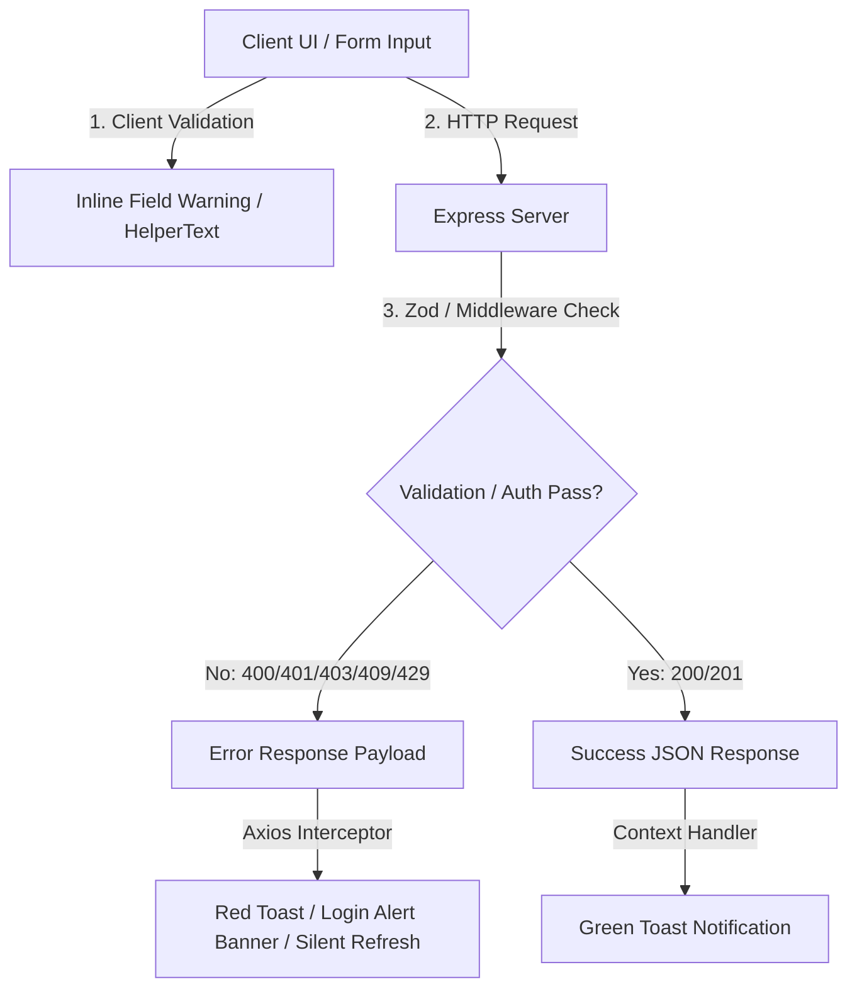

# Hunting Lodge App - Comprehensive Manual Testing Guide

This guide provides an end-to-end, structured manual verification plan for the **Hunting Lodge App**. It incorporates all recent architectural and UX updates across `client/src/` and `server/src/`, establishing concrete, deterministic checkpoints for Happy Path workflows, Validation Edge Cases, SSO/Session scenarios, and Role-Based Access Control (RBAC) visibility.

Every test case follows a strict **GIVEN-WHEN-THEN** flow adhering to intent-driven development standards. All assertions specify exact, deterministic UI outcomes (e.g. specific toast notification messages, color severities, form field helper texts, and HTTP error payloads).

---

## Table of Contents

1. [Test Environment & Setup](#1-test-environment--setup)
   - 1.1 [Prerequisites & Seed Data](#11-prerequisites--seed-data)
   - 1.2 [Application Endpoints & Health Probes](#12-application-endpoints--health-probes)
   - 1.3 [Architectural Layer & Exception Mapping Model](#13-architectural-layer--exception-mapping-model)
2. [User Personas & Role Matrix](#2-user-personas--role-matrix)
   - 2.1 [Access Control Matrix](#21-access-control-matrix)
   - 2.2 [Dynamic Group Tenancy & Context Switching](#22-dynamic-group-tenancy--context-switching)
3. [Suite 1: SSO, Authentication & Session Management](#3-suite-1-sso-authentication--session-management)
   - 3.1 [Test Case 1.1: SSO Login & First-Time User Auto-Registration (Happy Path)](#test-case-11-sso-login--first-time-user-auto-registration-happy-path)
   - 3.2 [Test Case 1.2: Returning User Login & Claim Refresh (Happy Path)](#test-case-12-returning-user-login--claim-refresh-happy-path)
   - 3.3 [Test Case 1.3: Super Admin Auto-Role Assignment via OIDC Claims (Happy Path)](#test-case-13-super-admin-auto-role-assignment-via-oidc-claims-happy-path)
   - 3.4 [Test Case 1.4: Missing Token Claims & Fallback Resolution (Edge Case)](#test-case-14-missing-token-claims--fallback-resolution-edge-case)
   - 3.5 [Test Case 1.5: Invalid SSO Authorization Code & IdP Error Handling (Edge Case)](#test-case-15-invalid-sso-authorization-code--idp-error-handling-edge-case)
   - 3.6 [Test Case 1.6: Authentication Rate Limiting - HTTP 429 (Edge Case)](#test-case-16-authentication-rate-limiting---http-429-edge-case)
   - 3.7 [Test Case 1.7: Client In-Flight GET Request Deduplication (Session)](#test-case-17-client-in-flight-get-request-deduplication-session)
   - 3.8 [Test Case 1.8: Global 401 Interceptor & Silent Session Refresh Flow (Session)](#test-case-18-global-401-interceptor--silent-session-refresh-flow-session)
   - 3.9 [Test Case 1.9: In-Memory User Cache TTL (30s) & Mid-Session Deactivation (Session)](#test-case-19-in-memory-user-cache-ttl-30s--mid-session-deactivation-session)
   - 3.10 [Test Case 1.10: Expired JWT Token Handling & Refresh Retry (Session)](#test-case-110-expired-jwt-token-handling--refresh-retry-session)
   - 3.11 [Test Case 1.11: Unauthenticated Deep Linking Interception (Session)](#test-case-111-unauthenticated-deep-linking-interception-session)
   - 3.12 [Test Case 1.12: First-Time User Feature Walkthrough & 'What's New' Modal Lifecycle (Session)](#test-case-112-first-time-user-feature-walkthrough--whats-new-modal-lifecycle-session)
4. [Suite 2: Role-Based Access Control (RBAC) & Visibility Boundaries](#4-suite-2-role-based-access-control-rbac--visibility-boundaries)
   - 4.1 [Test Case 2.1: Guest User Isolation & Protected Route Interception (Guest)](#test-case-21-guest-user-isolation--protected-route-interception-guest)
   - 4.2 [Test Case 2.2: Standard Member & Non-Manager Admin Published-Only Schedule View (Member/Admin)](#test-case-22-standard-member--non-manager-admin-published-only-schedule-view-memberadmin)
   - 4.3 [Test Case 2.3: Standard Member & Non-Manager Admin Report Deletion Prohibition (Member/Admin)](#test-case-23-standard-member--non-manager-admin-report-deletion-prohibition-memberadmin)
   - 4.4 [Test Case 2.4: Shift Manager UI Badge & Group Settings Access (Manager)](#test-case-24-shift-manager-ui-badge--group-settings-access-manager)
   - 4.5 [Test Case 2.5: Shift Manager Schedule Edit & Draft Save (Manager)](#test-case-25-shift-manager-schedule-edit--draft-save-manager)
   - 4.6 [Test Case 2.6: Shift Schedule Publishing & Fractional Vacation Day Deduction (Manager)](#test-case-26-shift-schedule-publishing--fractional-vacation-day-deduction-manager)
   - 4.7 [Test Case 2.7: Shift Manager Group Tenancy Boundary Check (Manager)](#test-case-27-shift-manager-group-tenancy-boundary-check-manager)
   - 4.8 [Test Case 2.8: Administrator Navbar Badging & Dynamic Group Switching (Admin)](#test-case-28-administrator-navbar-badging--dynamic-group-switching-admin)
   - 4.9 [Test Case 2.9: Administrator Self-Deletion Prevention (Security Invariant)](#test-case-29-administrator-self-deletion-prevention-security-invariant)
   - 4.10 [Test Case 2.10: Root Super Admin Account Protection Locks (Security Invariant)](#test-case-210-root-super-admin-account-protection-locks-security-invariant)
   - 4.11 [Test Case 2.11: Protected System Group Lifecycle Locks (Security Invariant)](#test-case-211-protected-system-group-lifecycle-locks-security-invariant)
   - 4.12 [Test Case 2.12: Vacation Request Lifecycle & Quota Management (Manager/Member)](#test-case-212-vacation-request-lifecycle--quota-management-managermember)
5. [Suite 3: Happy Path End-to-End Operational Workflows](#5-suite-3-happy-path-end-to-end-operational-workflows)
   - 5.1 [Test Case 3.1: Sites & Bookmarks Management (CRUD, Tags & Favorites)](#test-case-31-sites--bookmarks-management-crud-tags--favorites)
   - 5.2 [Test Case 3.2: Phone Directory Management (CRUD, Formatting & Details Modal)](#test-case-32-phone-directory-management-crud-formatting--details-modal)
   - 5.3 [Test Case 3.3: Shift Schedule Viewer (Navigation, Fullscreen & Responsive Matrix)](#test-case-33-shift-schedule-viewer-navigation-fullscreen--responsive-matrix)
   - 5.4 [Test Case 3.4: Shift Reports Management (Auto-Detection, Tiptap Editor & Unique Compound Index)](#test-case-34-shift-reports-management-auto-detection-tiptap-editor--unique-compound-index)
   - 5.5 [Test Case 3.5: Group Settings Configuration (Shift Types, Time Slots & Reordering)](#test-case-35-group-settings-configuration-shift-types-time-slots--reordering)
   - 5.6 [Test Case 3.6: Admin User & Group Oversight (CRUD, Roles & Live Population)](#test-case-36-admin-user--group-oversight-crud-roles--live-population)
   - 5.7 [Test Case 3.7: About & Support Dialog (Dynamic Vite Version & Support Hotline)](#test-case-37-about--support-dialog-dynamic-vite-version--support-hotline)
6. [Suite 4: Validation Edge Cases & Server Exception Mappings](#6-suite-4-validation-edge-cases--server-exception-mappings)
   - 6.1 [Exception-to-Toast/Warning Mapping Matrix](#61-exception-to-toastwarning-mapping-matrix)
   - 6.2 [Test Case 4.1: Sites Form Field Required Validations (Client-Side)](#test-case-41-sites-form-field-required-validations-client-side)
   - 6.3 [Test Case 4.2: Phone Directory Multi-Number & Type Formatting (Client-Side)](#test-case-42-phone-directory-multi-number--type-formatting-client-side)
   - 6.4 [Test Case 4.3: Member Vacation Balance Negative Boundary (API Validation)](#test-case-43-member-vacation-balance-negative-boundary-api-validation)
   - 6.5 [Test Case 4.4: User Reordering Malformed Payload (API Zod Validation)](#test-case-44-user-reordering-malformed-payload-api-zod-validation)
   - 6.6 [Test Case 4.5: Locked Shift Report Modification Invariant (`REPORT_LOCKED`)](#test-case-45-locked-shift-report-modification-invariant-report_locked)
   - 6.7 [Test Case 4.6: Deleting Group with Active Members Guard](#test-case-46-deleting-group-with-active-members-guard)
   - 6.8 [Test Case 4.7: Duplicate Shift Report Title Rejection (Duplicate Key Guard)](#test-case-47-duplicate-shift-report-title-rejection-duplicate-key-guard)
7. [Suite 5: Cross-Cutting & System-Wide Checks](#7-suite-5-cross-cutting--system-wide-checks)
   - 7.1 [Test Case 5.1: Light & Dark Mode Contrast Verification](#test-case-51-light--dark-mode-contrast-verification)
   - 7.2 [Test Case 5.2: Responsive Viewport Breakpoints (Mobile, Tablet, Desktop)](#test-case-52-responsive-viewport-breakpoints-mobile-tablet-desktop)
   - 7.3 [Test Case 5.3: Global Toast Notification System Auto-Dismiss Timers](#test-case-53-global-toast-notification-system-auto-dismiss-timers)
   - 7.4 [Test Case 5.4: Custom 404 Route Fallback](#test-case-54-custom-404-route-fallback)
   - 7.5 [Test Case 5.5: Container Health Probes Verification (OpenShift / Kubernetes)](#test-case-55-container-health-probes-verification-openshift--kubernetes)
8. [Test Execution & Sign-Off Checklist](#8-test-execution--sign-off-checklist)

---

## 1. Test Environment & Setup

### 1.1 Prerequisites & Seed Data

Ensure application dependencies are installed, local databases are active, and sample test fixtures are loaded. Database bootstrapping can be performed using either of the following commands:

```bash
# In project root - concurrently starts server, seeds database, and boots Vite client:
npm run dev:seed

# Run standard database seed script directly:
npm run seed

# Run example database reset and seed script with sample fixtures:
npm run seed:example
```

> [!NOTE]
> Seeding the database resets existing collections and populates deterministic test fixtures across **10 core data models**:
>
> 1. **User:** Deterministic account states for automated and manual verification:
>    - **Super Admin Account:** `username: "10001"` (Display: `Admin User`, Email: `admin@corp.local` or `admin@dev.local`, Groups: `ADMINISTRATORS` [Manager], `noc` [Manager], `hasSeenWhatsNew: true`, `vacationBalance: 999`).
>    - **Regular Member Account / Auth0 Test User:** `username: "dov-member"` / `"10002"` (Display: `dov-member` / `Regular User`, Email: `member@test.local`, Auth0 Password: `dov-member123`, Groups: `noc` [Member], `hasSeenWhatsNew: false`, `vacationBalance: 18`).
> 2. **Group:**
>    - `ADMINISTRATORS` (System Protected, `isSystemGroup: true`, configured via `config.superAdmin.groupName`).
>    - `noc` (Operational Group, contains shift types and time slots).
> 3. **Site:** Initial bookmark entries (`NOC Dashboard`, `Shift Log Tool`, `Company Portal`) with tags (`General`, `Tacti`) and user favorites.
> 4. **Phone:** Directory contacts (`David` [Mobile], `HQ` [Landline]) with auto-formatted numbers.
> 5. **ShiftType:** Configured within group settings (`בוקר` / Morning, `ערב` / Evening, `לילה` / Night, `אפטר` / After, `אמצע` / Middle, `שבת` / Weekend, `חופש` / Vacation [isVacation: true], `חול` / Leave [isVacation: true]).
> 6. **TimeSlot:** Configured working slots (`Morning Shift`, `Evening Shift`, `Night Shift`, `Weekend Shift`, `Middle Shift`) linked exclusively to working shift types.
> 7. **ShiftSchedule:** Published schedule for the current week containing scheduled member shifts and vacation entries.
> 8. **ShiftReport:** Historical shift reports with rich HTML tasks, previous task handoffs, and attendee records. Guarded by compound unique index `{ groupId: 1, title: 1 }`.
> 9. **VacationRequest:** Pre-seeded requests demonstrating lifecycle states:
>    - 1 Approved Full-Day Request: `vacationValue: 1.0`, `status: "approved"`, `notes: "Approved annual vacation"`.
>    - 1 Pending Half-Day Request: `vacationValue: 0.5`, `status: "pending"`, `notes: "Request for half-day personal leave"`.
> 10. **Shift:** Shift records supporting fractional values (`vacationValue: 1.0` and `vacationValue: 0.5`) with atomic `vacationDeducted` tracking.

### 1.2 Application Endpoints & Health Probes

- **Client Application:** `http://localhost:5173` (Vite dev server)
- **Backend REST API:** `http://localhost:5000` (or `PORT` from `.env`)
- **OpenShift / Kubernetes Health Probes:**
  - `GET /healthz` - **Liveness Probe**: Non-blocking in-memory process uptime check. Deliberately bypasses MongoDB to prevent cascading container restarts during transient DB hiccups. Returns HTTP 200 `{ "status": "UP", "uptime": ..., "environment": ... }`.
  - `GET /api/health` - **Readiness Probe**: In-memory inspection of `mongoose.connection.readyState === 1`. Returns HTTP 200 `{ "status": "UP", "database": { "status": "connected", "readyState": 1 } }` when ready to serve traffic, or HTTP 503 `DEGRADED` to detach the pod from OpenShift endpoints when disconnected.
  - `GET /startup` / `GET /api/startup` - **Startup Probe**: Container bootstrap check. Returns HTTP 200 `{ "status": "UP", "initialized": true }` once initial database connection succeeds, or HTTP 503 `STARTING`.

#### Core API Routing Matrix:
- **Authentication & Claims:**
  - `GET /api/auth/me` - Session restoration and claim verification (JWT Bearer or `hunting_token` cookie).
  - `POST /api/auth/login` - Local and SSO callback authentication (`code`, optional `state`).
  - `GET /api/auth/sso-url` - SSO IdP redirection URL generation with PKCE challenge and state cookie.
  - `POST /api/auth/refresh` - Silent session refresh using httpOnly `hunting_refresh_token` cookie; issues renewed session token/cookie.
  - `POST /api/auth/logout` - Terminates session, clears httpOnly auth cookies (`hunting_token`, `hunting_refresh_token`), and issues logout redirect URL.
- **User Management & Onboarding:**
  - `GET /api/users` - Directory listing (group-scoped or global admin).
  - `PATCH /api/users/whats-new` - First-time user feature walkthrough acknowledgement.
  - `PATCH /api/users/:id/whats-new` - Explicit user feature acknowledgement.
  - `PATCH /api/users/:id/manager-update` - Manager status and vacation quota adjustments.
  - `PUT /api/users/reorder/group` - Roster display ordering updates.
- **Vacation Lifecycle & Quotas:**
  - `POST /api/vacations` - Member vacation request submission (supports `0.5` and `1.0`, notes supported on API/schema).
  - `GET /api/vacations` - Group vacation requests query filtered by status or user.
  - `PATCH /api/vacations/:id/status` - Manager approval/rejection with atomic quota updates.
  - `GET /api/vacations/balance` - Aggregated user leave balance calculation.
- **Shift Rostering & Operational Reports:**
  - `GET /api/schedules` & `PUT /api/schedules` - Schedule drafting and live retrieval.
  - `POST /api/schedules/publish` - Publishing schedule with fractional leave deduction (`POST /api/schedules/publish`).
  - `GET /api/reports` & `POST /api/reports` - Operational shift handoff logs (unique compound index on `{ groupId: 1, title: 1 }`).
  - `PUT /api/reports/:id` & `DELETE /api/reports/:id` - Log modification and manager deletion.

### 1.3 Architectural Layer & Exception Mapping Model

The application enforces a 4-tier validation and notification boundary:



- **Client Form Level:** Immediate field border highlights and red `helperText` (e.g. `"Name is required"`).
- **Zod Schema Level (`400 Bad Request`):** Handled by `validateRequest` in `validationMiddleware.ts` yielding `code: "VALIDATION_ERROR"`.
- **RBAC Security Level (`403 Forbidden`):** Handled by `authMiddleware.ts` (`FORBIDDEN_ADMIN_REQUIRED`, `FORBIDDEN_GROUP_MEMBER_REQUIRED`, `FORBIDDEN_SHIFT_MANAGER_REQUIRED`) and `usersController.ts` account safety guards (`FORBIDDEN_SELF_DELETION`, `FORBIDDEN_SUPER_ADMIN_PROTECTED`).
- **Conflict Level (`409 Conflict`):** Handled by `errorMiddleware.ts` catching MongoDB unique index violations (e.g., `{ groupId: 1, title: 1 }`), yielding `code: "DUPLICATE_KEY"`.
- **Global Toast Level:** Rendered via `NotificationContext.tsx` anchored at bottom-right (`variant="filled"`).

> [!IMPORTANT]
> **Server-Driven Role-Based Access Control (RBAC):**
> Role evaluations are strictly server-driven. Responses from `/api/auth/me`, `/api/auth/login`, and `/api/users` provide explicit boolean flags:
> - `isSuperAdmin`: Identifies the system root administrator with global oversight.
> - `isAdmin`: Evaluated dynamically when the user is operating within an active administrative group (`isSystemGroup: true`, configured as `ADMINISTRATORS`).
> - `isShiftManager`: Evaluated dynamically per active group context based on the user's `role: "shift_manager"` assignment.
> Legacy client-side environment configurations (such as `VITE_SUPER_ADMIN_GROUP_NAME`) have been completely eliminated. `UserContext.tsx` dynamically binds these server-provided flags to current UI state.

---

## 2. User Personas & Role Matrix

### 2.1 Access Control Matrix

| Route / Capability                     |    Unauthenticated    | Guest (`groups: []`)  | Regular Member (`member`) | Shift Manager (`shift_manager`) | System Administrator (`ADMINISTRATORS`) |
| :------------------------------------- | :-------------------: | :-------------------: | :-----------------------: | :-----------------------------: | :-------------------------------------: |
| **Login (`/login`)**                   |     ✅ Accessible     |   🔄 Redirects `/`    |     🔄 Redirects `/`      |        🔄 Redirects `/`         |               🔄 Redirects `/`          |
| **Guest Screen (`/guest`)**            | 🔄 Redirects `/login` |       ✅ Landed       |     🔄 Redirects `/`      |        🔄 Redirects `/`         |               🔄 Redirects `/`          |
| **Global Navbar**                      |       ❌ Hidden       |       ❌ Hidden       |        ✅ Visible         |     ✅ Visible (+Dot Badge)     |         ✅ Visible (+Admin Controls)    |
| **Sites (`/`)**                        | ⛔ Redirects `/login` | ⛔ Redirects `/guest` |      ✅ Full Access       |         ✅ Full Access          |                ✅ Full Access           |
| **Phone Directory (`/phones`)**        | ⛔ Redirects `/login` | ⛔ Redirects `/guest` |      ✅ Full Access       |         ✅ Full Access          |                ✅ Full Access           |
| **Shift Schedule (`/schedule`)**       | ⛔ Redirects `/login` | ⛔ Redirects `/guest` |     👁️ Published Only     |    ✏️ Create, Edit, Publish     |      👁️ Published Only* (Unless Manager) |
| **Shift Reports (`/reports`)**         | ⛔ Redirects `/login` | ⛔ Redirects `/guest` |   👁️ View & Create/Edit   |     🗑️ Create, Edit, Delete     |      👁️ View & Create/Edit* (No Delete)|
| **Group Settings (`/group-settings`)** | ⛔ Redirects `/login` | ⛔ Redirects `/guest` |  ⛔ Access Denied (`/`)   |      ✅ Full Config Access      |     ✅ Full Config Access (When Manager)|
| **Admin Dashboard (`/admin/users`)**   | ⛔ Redirects `/login` | ⛔ Redirects `/guest` |  ⛔ Access Denied (`/`)   |     ⛔ Access Denied (`/`)      |      ✅ Full CRUD (When in Admin Group) |

> [!IMPORTANT]
> **Administrative Scope Invariant for Shift Schedule & Reports:**
> - **Shift Schedule (`/schedule`):** An administrator user has **"Published Only"** rights on the shift schedule page. Only a user holding explicit manager rights (`role: "shift_manager"`) for that specific group can create, edit, save drafts, or publish schedules (`saveSchedule` and `publishSchedule` in `schedulesController.ts`).
> - **Shift Reports (`/reports`):** An administrator user has **"View & Create/Edit"** rights on the shift reports page (equivalent to standard member tier). Only a user holding explicit manager rights (`role: "shift_manager"`) for that specific group has rights to delete shift reports (`deleteReport` in `reportsController.ts`).

### 2.2 Dynamic Group Tenancy & Context Switching

Permissions in `UserContext.tsx` and server authorization middleware are dynamically scoped to the **Active Group Context**:

1. **Administrative Elevation:** A user only receives `isAdmin: true` when their active group in the Navbar is set to `ADMINISTRATORS` (or `config.superAdmin.groupName` where `isSystemGroup: true`). When switching to an operational group such as `noc`, system administrative privileges do not grant operational manager rights.
2. **Shift Schedule Guard:** System Administrators have **Published Only** access on `/schedule`. Only a user explicitly assigned `role: "shift_manager"` in the active group can create, edit, save drafts, or publish schedules (`saveSchedule` and `publishSchedule` in `schedulesController.ts`).
3. **Shift Reports Guard:** System Administrators have **View & Create/Edit** access on `/reports`. Only a user explicitly assigned `role: "shift_manager"` in the active group can delete shift reports (`deleteReport` in `reportsController.ts`).
4. **Managerial Tenancy:** A user only receives `isShiftManager: true` if their membership for the **currently active group** has `role: "shift_manager"`.
5. **Data Isolation:** Standard users querying `/api/users?groupId=...` receive only peers within their active group. Direct requests to `/api/users` without `groupId` are strictly reserved for Administrators.

---

## 3. Suite 1: SSO, Authentication & Session Management

### Test Case 1.1: SSO Login & First-Time User Auto-Registration (Happy Path)

- **Objective:** Verify that a new user logging in via OpenID Connect (OIDC) is automatically provisioned in the database and issued a valid session.
- **Preconditions:** User exists in the mock SSO IdP (`username: "new_cadet"`, `email: "cadet@dev.local"`) but does not exist in the app database.
- **GIVEN:** Browser is at `http://localhost:5173/login` in Incognito mode with no active session tokens.
- **WHEN:** User clicks **"Login with Organization SSO"** and authenticates through the IdP callback to `/auth/callback?code=mock_valid_code`.
- **THEN:**
  1. Frontend displays `ThinkingLoader.tsx` while `loginWithCode` in `authApi.ts` posts to `/api/auth/login`.
  2. Server creates a new document in `User.ts` with `username: "new_cadet"`, `isActive: true`, `groups: []`, `hasSeenWhatsNew: false`, and returns a signed JWT.
  3. Client stores `hunting_token` and `hunting_userId` in `localStorage`.
  4. User is redirected to `/guest` because `groups` is empty.
  5. Once an administrator assigns `new_cadet` to an operational group and the user navigates to `/`, the blocking "What's New" modal will mount automatically (see [Test Case 1.12](#test-case-112-first-time-user-feature-walkthrough--whats-new-modal-lifecycle-session)).
- **Must Not:** Crash or create duplicate users on consecutive requests.
- **Failure Consequence:** New personnel cannot enter the platform.

---

### Test Case 1.2: Returning User Login & Claim Refresh (Happy Path)

- **Objective:** Verify returning users have their `lastLogin` timestamp and claims updated upon subsequent logins, respecting their `hasSeenWhatsNew` onboarding status.
- **Preconditions:** User `10002` already exists in MongoDB with `hasSeenWhatsNew: false`. User `10001` exists with `hasSeenWhatsNew: true`.
- **GIVEN:** User `10002` initiates SSO callback via `/auth/callback?code=mock_user_code`.
- **WHEN:** Server executes `login` in `authController.ts`.
- **THEN:**
  1. Server updates `lastLogin` ISO timestamp on the user record.
  2. Server returns existing user profile and signed JWT.
  3. Client redirects to `/` with the active group `noc`.
  4. Because `user.hasSeenWhatsNew === false`, `SitesPage` detects an un-acknowledged feature tour and immediately mounts the centered blocking `WhatsNewModal` (see [Test Case 1.12](#test-case-112-first-time-user-feature-walkthrough--whats-new-modal-lifecycle-session)).
  5. In contrast, when Super Admin `10001` (`hasSeenWhatsNew: true`) logs in, the `WhatsNewModal` is bypassed entirely, rendering the Sites dashboard immediately.
- **Must Not:** Overwrite custom user configurations or reset vacation balances.
- **Failure Consequence:** Loss of member group assignments or historical statistics.

---

### Test Case 1.3: Super Admin Auto-Role Assignment via OIDC Claims (Happy Path)

- **Objective:** Verify that incoming SSO token claims with administrative groups automatically link the account to the system admin group `ADMINISTRATORS`.
- **Preconditions:** SSO user provides claim `groups: ["ADMINISTRATORS"]` or matches `config.superAdmin.groupName`.
- **GIVEN:** Unassigned or new user logs in via SSO.
- **WHEN:** Token claims contain the administrative role.
- **THEN:**
  1. `authController.ts` dynamically adds an entry to `user.groups` with `groupId: ADMINISTRATORS` and `role: "shift_manager"`.
  2. The admin group document adds the user `_id` to its `members` array.
  3. Client lands on `/` with red avatar badge and red **"Users & Groups"** navigation button visible.
- **Must Not:** Require manual database intervention to grant administrative onboarding.
- **Failure Consequence:** System administrators locked out of fresh environments.

---

### Test Case 1.4: Missing Token Claims & Fallback Resolution (Edge Case)

- **Objective:** Verify graceful handling when the SSO identity provider returns incomplete token claims (e.g. missing `preferred_username` or `email`).
- **Preconditions:** IdP returns claims containing only `sub: "auth0|998877"` and `nickname: "cadet99"`.
- **GIVEN:** Callback is triggered with the degraded token payload.
- **WHEN:** `authController.ts` parses claims.
- **THEN:**
  1. Fallback chain selects `nickname` or `sub` as `dbUsername`.
  2. Synthetic internal email format is assigned: `cadet99@organization.local`.
  3. Registration succeeds without HTTP 500 error.
- **Must Not:** Fail with unhandled rejection or insert empty username strings into the database.
- **Failure Consequence:** SSO authentication crashes when external identity schemas differ.

---

### Test Case 1.5: Invalid SSO Authorization Code & IdP Error Handling (Edge Case)

- **Objective:** Verify deterministic error notification and redirection when the SSO authorization code exchange fails or the IdP returns an explicit error parameter.
- **Preconditions:**
  - Scenario A: Browser receives an invalid, tampered, or expired authorization code `code=invalid_xyz`.
  - Scenario B: Identity provider redirects back with error query parameters: `/auth/callback?error=access_denied&error_description=User%20declined%20consent`.
- **GIVEN:** User visits the SSO callback route.
- **WHEN:**
  - In Scenario A: Client submits the invalid code to `POST /api/auth/login`. Server rejects with HTTP 401 `{ "message": "SSO Authentication failed", "error": "Invalid authorization code or provider error" }`.
  - In Scenario B: `SSOCallback.tsx` parses URL parameters and detects `error` and `error_description`.
- **THEN:**
  1. `SSOCallback.tsx` immediately extracts the error parameter and executes `navigate("/login?error=" + encodeURIComponent(errorParam), { replace: true })`.
  2. Browser navigates to `/login?error=...`.
  3. `LoginFeedback.tsx` detects `urlError` and renders a red alert banner above the login button:
     ```text
     "Authentication failed. Please try again."
     ```
  4. The application does not freeze on `ThinkingLoader.tsx` or enter a redirect loop.
- **Must Not:** Leave the application in an infinite loading spinner loop or flash unhandled exceptions.
- **Failure Consequence:** Confusing white screen or stuck loader on auth failure.

---

### Test Case 1.6: Authentication Rate Limiting - HTTP 429 (Edge Case)

- **Objective:** Verify that brute-force requests to `/api/auth/sso-url` or `/api/auth/login` trigger the rate limiter.
- **Preconditions:** Backend rate limiter configured with max 50 requests per 15-minute window (`authRateLimiter`).
- **GIVEN:** A client makes 51 rapid requests to `/api/auth/sso-url` within 1 minute.
- **WHEN:** The 51st request hits the server.
- **THEN:**
  1. Server returns HTTP 429 Too Many Requests:
     ```json
     {
       "message": "Too many authentication attempts, please try again after 15 minutes",
       "code": "RATE_LIMIT_EXCEEDED"
     }
     ```
  2. Client catches the error and displays a red Toast notification:
     ```text
     "Failed to connect to SSO server. Please check your connection or contact support."
     ```
- **Must Not:** Degrade or crash the Node.js event loop.
- **Failure Consequence:** Vulnerability to DoS or brute-force code enumeration.

---

### Test Case 1.7: Client In-Flight GET Request Deduplication (Session)

- **Objective:** Verify that rapid concurrent GET requests to the same endpoint are deduplicated to reduce server load.
- **Preconditions:** Client is authenticated and components mount simultaneously.
- **GIVEN:** Two components fire `getPhones()` in `phonesApi.ts` at the exact same millisecond.
- **WHEN:** `apiClient.ts` processes the outgoing calls.
- **THEN:**
  1. `inFlightRequests` Map captures the first promise and reuses it for the second call.
  2. Only 1 physical HTTP request is recorded in DevTools Network tab.
  3. Both components resolve with the identical response data.
- **Must Not:** Return stale data on subsequent user-initiated button refreshes.
- **Failure Consequence:** Network request storms and UI race conditions.

---

### Test Case 1.8: Global 401 Interceptor & Silent Session Refresh Flow (Session)

- **Objective:** Verify that when an authenticated API call receives HTTP 401 Unauthorized, the client executes a silent session refresh before forcing session termination.
- **Preconditions:** User is logged in with active `hunting_token` in `localStorage` and valid httpOnly `hunting_refresh_token` session cookie.
- **GIVEN:** User is browsing `http://localhost:5173/phones`.
- **WHEN:** A background request receives HTTP 401 (e.g. access JWT expired after TTL).
- **THEN:**
  1. `apiClient.ts` response interceptor intercepts the HTTP 401.
  2. If `originalRequest._retry` is false and the request is not an auth route (`/auth/refresh`, `/auth/login`), the interceptor marks `_retry = true` and invokes `attemptRefresh()`.
  3. **Concurrent Request Deduplication:** If multiple concurrent requests trigger 401 simultaneously, they share the single in-flight `refreshPromise` rather than dispatching redundant `/auth/refresh` calls.
  4. **Silent Refresh Success Flow:**
     - Client calls `POST /api/auth/refresh` with `withCredentials: true`.
     - Server issues a renewed token and updates cookies.
     - Interceptor updates `localStorage.setItem("hunting_token", newToken)`.
     - Interceptor updates `originalRequest.headers.Authorization = "Bearer " + newToken` and re-executes the original request via `axiosInstance(originalRequest)`.
     - User experiences zero interruption or page flickers.
  5. **Refresh Failure Fallback (Session Expiry):**
     - If `/api/auth/refresh` itself returns HTTP 401 or 403 (refresh token expired or invalid):
       - `apiClient.ts` removes `hunting_token`, `hunting_userId`, and `hunting_groupId` from `localStorage`.
       - If current route is not `/login` or `/auth/callback`, navigates to: `window.location.href = "/login?error=session_expired"`.
       - `LoginFeedback.tsx` displays red alert banner:
         ```text
         "Authentication failed. Please try again."
         ```
  6. **Network Error Resilience:**
     - If a non-401/403 network error (e.g. timeout, connection reset) occurs during the refresh attempt, the client retains stored credentials to avoid prematurely wiping local sessions during transient network hiccups.
- **Must Not:** Retain broken JWTs upon confirmed refresh failure or enter an infinite retry loop.
- **Failure Consequence:** Unnecessary user logouts on routine token expirations, or stuck sessions on expired tokens.

---

### Test Case 1.9: In-Memory User Cache TTL (30s) & Mid-Session Deactivation (Session)

- **Objective:** Verify that the server's in-memory session cache maintains a 30-second TTL and revokes access when an account is marked inactive.
- **Preconditions:** User `10002` is actively logged in.
- **GIVEN:** User `10002` is authenticated with active cache entry in `authMiddleware.ts`.
- **WHEN:** Admin sets `isActive: false` on `10002` directly in the database.
- **THEN:**
  1. Within 0-29 seconds: Immediate requests may succeed via the cached session.
  2. After 30 seconds: The cache entry expires. The next request queries MongoDB, detects `isActive === false`, purges the cache, and returns HTTP 401:
     ```json
     {
       "message": "Unauthorized: User not found or inactive",
       "code": "USER_INACTIVE"
     }
     ```
  3. Client catches the 401, attempts silent refresh (which also fails due to inactive account), purges credentials, and redirects to `/login?error=session_expired`.
- **Must Not:** Allow deactivated users to indefinitely perform read/write actions.
- **Failure Consequence:** Deactivated personnel retaining active system access.

---

### Test Case 1.10: Expired JWT Token Handling & Refresh Retry (Session)

- **Objective:** Verify that expired cryptographic tokens are rejected by backend middleware and trigger the client-side silent refresh mechanism.
- **Preconditions:** Client holds a token with `exp` timestamp in the past.
- **GIVEN:** Request is dispatched with expired Bearer token in the `Authorization` header.
- **WHEN:** `authMiddleware.ts` executes `jwt.verify` in `jwt.ts`.
- **THEN:**
  1. Verification throws `TokenExpiredError`.
  2. Middleware responds with HTTP 401:
     ```json
     {
       "message": "Unauthorized: Token expired",
       "code": "TOKEN_EXPIRED"
     }
     ```
  3. `apiClient.ts` catches HTTP 401, invokes `POST /api/auth/refresh`, and seamlessly retries the operation if refresh succeeds.
  4. If the refresh cookie is also expired, client completes clean teardown and redirects to `/login?error=session_expired`.
- **Must Not:** Leak internal stack traces or cryptographic keys in the response.
- **Failure Consequence:** Security vulnerability or unexpected crash.

---

### Test Case 1.11: Unauthenticated Deep Linking Interception (Session)

- **Objective:** Verify unauthenticated users attempting to access protected deep routes are blocked and redirected.
- **Preconditions:** Clear all cookies and `localStorage` keys in an Incognito window.
- **GIVEN:** Browser address bar is set directly to `http://localhost:5173/group-settings`.
- **WHEN:** User presses Enter.
- **THEN:**
  1. `App.tsx` detects `user === null` and `token === null`.
  2. Route redirects immediately to `/login`.
  3. Top navigation bar is completely hidden.
- **Must Not:** Flash protected group configuration data prior to redirecting.
- **Failure Consequence:** Unauthorized data exposure during initial render.

---

### Test Case 1.12: First-Time User Feature Walkthrough & 'What's New' Modal Lifecycle (Session)

- **Objective:** Verify centered blocking slide wizard behavior, stepper dot progression, version chip display, API acknowledgement dispatch, and permanent dismissal across page reloads.
- **Preconditions:** User `10002` (Regular User) is seeded with `hasSeenWhatsNew: false`. User holds active membership in `noc`.
- **GIVEN:** User `10002` logs into the application and navigates to `http://localhost:5173/`.
- **WHEN:** `SitesPage.tsx` detects `user.hasSeenWhatsNew === false` and mounts `WhatsNewModal.tsx`:
  1. **Strict Blocking Verification:**
     - Click outside the modal on the backdrop: verify modal does **NOT** dismiss.
     - Press the `Escape` key on keyboard: verify modal does **NOT** dismiss (`disableEscapeKeyDown` prop active).
  2. **Slide 1 Header & Content Inspection:**
     - Top Bar: Stepper counter displays `"1 of 4"`. Feature tag chip displays `"Schedule"`. Version chip displays `"v1.0.0"`.
     - Icon & Title: Displays Calendar icon and title `"Shift Scheduling & Calendar"`.
     - Description: `"Interactive monthly calendar and weekly rosters with real-time slot constraints, seamless shift coverage, and clear shift assignments."`.
     - Key Benefit Pill: `"✨ Instant visibility on upcoming rosters and team coverage"`.
     - Action Controls: "Back" button is disabled and hidden (`visibility: hidden`). Click **"Next"** button.
  3. **Slide 2 (Operational Shift Reports):**
     - Counter advances to `"2 of 4"`. Tag displays `"Reports"`.
     - Title: `"Operational Shift Reports"`.
     - Benefit Pill: `"✨ Zero handover gaps with structured digital shift logs"`.
     - Stepper Dots: The 2nd dot expands to width 24px with cyan accent color (`#0288d1`).
     - Click **"Back"** button: verify wizard returns to Slide 1 (`"1 of 4"`).
     - Click **"Next"** button twice: advance through Slide 2 to Slide 3.
  4. **Slide 3 (Vacation Management & Quotas):**
     - Counter advances to `"3 of 4"`. Tag displays `"Vacation"`.
     - Title: `"Vacation Management & Quotas"`.
     - Benefit Pill: `"✨ Self-service vacation balance tracking and quick approvals"`.
     - Accent color: Amber/Orange (`#ed6c02`). Click **"Next"**.
  5. **Slide 4 (Phone & Site Directory):**
     - Counter advances to `"4 of 4"`. Tag displays `"Directory"`.
     - Title: `"Phone & Site Directory"`.
     - Benefit Pill: `"✨ One-click access to critical emergency and site contacts"`.
     - Button Transition: The primary button transitions from "Next" to **"Got it, let's explore!"** accompanied by a checkmark icon.
  6. **Network Exception Edge Case Check:**
     - In DevTools Network tab, simulate "Offline".
     - Click **"Got it, let's explore!"**:
     - Modal remains open and renders a red inline Alert:
       ```text
       "Unable to save your acknowledgement at this time. Please check your connection and try again."
       ```
     - Reconnect network in DevTools.
  7. **Successful Acknowledgement Dispatch:**
     - Click **"Got it, let's explore!"**.
- **THEN:**
  1. Button transitions to loading state (`"Saving..."` with circular spinner).
  2. Client dispatches HTTP `PATCH /api/users/whats-new`.
  3. Server executes `acknowledgeWhatsNew` in `usersController.ts`, sets `hasSeenWhatsNew: true` on user document in MongoDB, and invalidates in-memory user cache (`invalidateUserCache`).
  4. Response returns HTTP 200: `{ "message": "What's new acknowledged", "hasSeenWhatsNew": true }`.
  5. Client calls `markWhatsNewSeen()` in `UserContext.tsx`, updating local user state.
  6. `WhatsNewModal` unmounts smoothly; `SitesPage` becomes fully interactive.
  7. Reload browser (`F5`): User remains on `/` and the modal does **NOT** mount again.
- **Must Not:** Allow dismissal via background click or Escape key, fail to persist acknowledgement, or loop on subsequent visits.
- **Failure Consequence:** First-time users trapped in modal or continually harassed by onboarding dialogs on every page load.

---

## 4. Suite 2: Role-Based Access Control (RBAC) & Visibility Boundaries

### Test Case 2.1: Guest User Isolation & Protected Route Interception (Guest)

- **Objective:** Verify users assigned to zero groups are restricted exclusively to `/guest`.
- **Preconditions:** User `new_cadet` exists with `groups: []`.
- **GIVEN:** User `new_cadet` logs in.
- **WHEN:** User attempts direct navigation to `http://localhost:5173/` or `http://localhost:5173/schedule`.
- **THEN:**
  1. `App.tsx` intercepts route because `user.groups.length === 0`.
  2. User is redirected to `/guest`.
  3. Guest landing page renders with centered illustration and pending alert:
     ```text
     "Your account is pending group assignment. Please contact your system administrator."
     ```
  4. Global Navbar remains completely hidden.
- **Must Not:** Allow guest users to read bookmarks, phones, or schedules.
- **Failure Consequence:** Unvetted accounts accessing sensitive internal directory data.

---

### Test Case 2.2: Standard Member & Non-Manager Admin Published-Only Schedule View (Member/Admin)

- **Objective:** Verify that non-manager members and administrators without explicit `shift_manager` role in the active group have strictly read-only access to published schedules.
- **Preconditions:**
  - Standard Member `10002` logged in (`role: "member"` in `noc`).
  - System Administrator `10001` switched to active group `noc` without manager role in `noc`.
- **GIVEN:** User visits `http://localhost:5173/schedule`.
- **WHEN:** User inspects the schedule interface.
- **THEN:**
  1. Schedule grid renders only published shifts.
  2. **"Save Changes"** (Draft) and **"Publish Schedule"** buttons are **COMPLETELY HIDDEN**.
  3. Table cells are non-interactive: clicking or right-clicking a cell does not open the shift assignment menu.
  4. Draft shifts (unpublished changes made by a manager) are invisible to standard members.
- **Must Not:** Allow non-managers to edit, draft, or publish rosters.
- **Failure Consequence:** Unauthorized alterations to operational rosters.

---

### Test Case 2.3: Standard Member & Non-Manager Admin Report Deletion Prohibition (Member/Admin)

- **Objective:** Verify that report deletion is strictly reserved for Shift Managers of that group, and forbidden for standard members and non-manager administrators.
- **Preconditions:** Authenticated in group `noc` as standard member or non-manager admin.
- **GIVEN:** User views a shift report on `http://localhost:5173/reports`.
- **WHEN:** User inspects the report action controls.
- **THEN:**
  1. The red **"Delete Report"** button is **NOT RENDERED**.
  2. If the user crafts a direct HTTP request `DELETE /api/reports/:id`, the server responds with HTTP 403 Forbidden:
     ```json
     {
       "message": "Forbidden: Only an explicit Shift Manager of this group can delete reports.",
       "code": "FORBIDDEN_SHIFT_MANAGER_REQUIRED"
     }
     ```
- **Must Not:** Permit report deletion by non-managers under any circumstances.
- **Failure Consequence:** Destruction of historical audit trails and handover logs.

---

### Test Case 2.4: Shift Manager UI Badge & Group Settings Access (Manager)

- **Objective:** Verify Shift Managers receive role badging and administrative access to Group Settings.
- **Preconditions:** User `10001` holds `role: "shift_manager"` in group `noc`.
- **GIVEN:** User logs in and selects group `noc`.
- **WHEN:** Inspecting Navbar and profile elements.
- **THEN:**
  1. Profile avatar in the Navbar displays a blue dot badge indicating manager status.
  2. User menu includes `(Shift Manager)` tag next to role name.
  3. Navbar includes a direct link / gear icon for **Group Settings** (`/group-settings`).
  4. Navigating to `/group-settings` loads all configuration tabs: Shift Types, Time Slots, Members, and General Settings.
- **Must Not:** Hide configuration controls from assigned shift managers.
- **Failure Consequence:** Inability of team leads to manage operational configurations.

---

### Test Case 2.5: Shift Manager Schedule Edit & Draft Save (Manager)

- **Objective:** Verify Shift Managers can assign shifts, modify rosters, and save drafts without affecting the published schedule.
- **Preconditions:** Authenticated as Shift Manager in `noc`.
- **GIVEN:** Shift schedule page `http://localhost:5173/schedule`.
- **WHEN:**
  1. Click an empty cell in the schedule grid.
  2. Assign member `10002` to `Morning Shift`.
  3. Click **"Save as Draft"**.
- **THEN:**
  1. Client sends `PUT /api/schedules` with the updated draft state.
  2. Green Toast notification displays:
     ```text
     "Schedule saved as Draft"
     ```
  3. Status badge indicates `"Draft (Unpublished Changes)"`.
  4. When viewed in another session by regular member `10002`, the newly drafted shift is **NOT** visible.
- **Must Not:** Overwrite published shifts before deliberate publication.
- **Failure Consequence:** Confusion caused by members viewing unfinalized rosters.

---

### Test Case 2.6: Shift Schedule Publishing & Fractional Vacation Day Deduction (Manager)

- **Objective:** Verify that publishing a schedule containing vacation shifts atomically deducts fractional and full days (`0.5` and `1.0`) from members' vacation quotas.
- **Preconditions:**
  - Shift Manager authenticated in `noc`.
  - Member `10002` has initial `vacationBalance: 18`.
- **GIVEN:** Schedule table on `http://localhost:5173/schedule`.
- **WHEN:**
  1. Manager assigns `10002` to a Full-Day Vacation (`חופש`, `vacationValue: 1.0`) on Sunday.
  2. Manager assigns `10002` to a Half-Day Vacation (`חופש`, `vacationValue: 0.5`) on Monday.
  3. Manager clicks **"Publish Schedule"** (`POST /api/schedules/publish`).
- **THEN:**
  1. Server aggregates vacation deductions for `10002`: `1.0 + 0.5 = 1.5` days.
  2. Server atomically decrements member's balance:
     ```typescript
     await User.findOneAndUpdate(
         { _id: userIdVal, vacationBalance: { $gte: 1.5 } },
         { $inc: { vacationBalance: -1.5 } },
         { returnDocument: "after" }
     );
     ```
  3. Server marks assigned shifts with `vacationDeducted: true` to prevent double deductions on subsequent updates.
  4. Client displays green Toast notification:
     ```text
     "Schedule Published Successfully!"
     ```
  5. Schedule header transitions to `"Published"`.
  6. Navigating to Group Settings -> Members Tab shows `10002`'s balance updated to `16.5` days.
- **Must Not:** Deduct integer-only increments or allow balances to become negative.
- **Failure Consequence:** Inaccurate vacation tracking and employee quota disputes.

---

### Test Case 2.7: Shift Manager Group Tenancy Boundary Check (Manager)

- **Objective:** Verify a Shift Manager of Group A cannot modify schedules, settings, or members of Group B.
- **Preconditions:** Manager is assigned `shift_manager` in `noc`, but is NOT a manager of `cyber_ops`.
- **GIVEN:** Authenticated session for Manager of `noc`.
- **WHEN:** Manager attempts to call `PUT /api/users/reorder/group` with `groupId: "cyber_ops_id"`.
- **THEN:**
  1. Server `usersController.ts` checks tenancy via `isShiftManager` in `authHelpers.ts`.
  2. Request is rejected with HTTP 403 Forbidden:
     ```json
     {
       "message": "Forbidden: Administrator or Shift Manager permissions required for this group.",
       "code": "FORBIDDEN_MANAGER_REQUIRED"
     }
     ```
  3. Client UI displays red Toast: `"Failed to update order"`.
- **Must Not:** Permit cross-departmental configuration leakage.
- **Failure Consequence:** Breach of organizational boundary separation.

---

### Test Case 2.8: Administrator Navbar Badging & Dynamic Group Switching (Admin)

- **Objective:** Verify Super Administrators receive system-level indicators, can seamlessly switch between administrative and operational groups, and correctly inherit group-level role restrictions on schedules and reports.
- **Preconditions:** Log in as Super Admin `10001`.
- **GIVEN:** Active group is `ADMINISTRATORS` (or `config.superAdmin.groupName`).
- **WHEN:** Inspecting Navbar and switching groups.
- **THEN:**
  1. User avatar has red background (`error.main`).
  2. Red **"Users & Groups"** button is visible in the Navbar.
  3. Clicking User Avatar -> Switch Group -> select an operational group (e.g. `noc`).
  4. URL updates to `/`. Red **"Users & Groups"** button disappears.
  5. Avatar background switches back to default theme color.
  6. Navigate to `/schedule`: System Administrator has **Published Only** rights (cells are inert; Save Changes and Publish Schedule buttons are hidden) unless explicitly assigned `role: "shift_manager"` for that group.
  7. Navigate to `/reports`: System Administrator has **View & Create/Edit** rights, but the red **"Delete Report"** button remains hidden unless explicitly assigned `role: "shift_manager"` for that group.
- **Must Not:** Retain full administrative CRUD or bypass group Shift Manager requirements on `/schedule` and `/reports`.
- **Failure Consequence:** Accidental global mutations or unauthorized schedule/report actions outside manager boundaries.

---

### Test Case 2.9: Administrator Self-Deletion Prevention (Security Invariant)

- **Objective:** Verify that administrators cannot delete their own account through the UI or via direct API calls.
- **Preconditions:** Logged in as Admin `10001` on `http://localhost:5173/admin/users`.
- **GIVEN:** Users table is displayed on the Admin page.
- **WHEN:** Locating the row corresponding to `10001` (Admin User).
- **THEN:**
  1. The Delete (trash) icon button is **COMPLETELY HIDDEN** for the currently authenticated row (`AdminTable.tsx` check: `!isCurrentUser`).
  2. If the admin attempts a manual HTTP `DELETE /api/users/10001_id`, the server rejects with HTTP 403:
     ```json
     {
       "message": "Forbidden: Administrators cannot delete their own accounts.",
       "code": "FORBIDDEN_SELF_DELETION"
     }
     ```
- **Must Not:** Allow system lock-out through accidental self-destruction.
- **Failure Consequence:** Orphaned database with zero accessible administrators.

---

### Test Case 2.10: Root Super Admin Account Protection Locks (Security Invariant)

- **Objective:** Verify that the primary root Super Admin account cannot be deactivated or deleted by any other administrator.
- **Preconditions:** Secondary admin is logged in, viewing Super Admin `10001` in `/admin/users`.
- **GIVEN:** Admin opens the edit dialog for `10001`.
- **WHEN:** Inspecting the security locks in `AdminDialogs.tsx`.
- **THEN:**
  1. An alert banner appears: `"Super Administrator - Core system account. Some restrictions apply."`
  2. The **Active User** switch is permanently **DISABLED**.
  3. Username textfield is disabled with helperText: `"User ID is managed via SSO and cannot be modified."`
  4. If an HTTP `PUT /api/users/:id` is sent with `{ "isActive": false }`, server returns HTTP 403:
     ```json
     {
       "message": "System Security: The root Super Admin account cannot be deactivated.",
       "code": "FORBIDDEN_SUPER_ADMIN_PROTECTED"
     }
     ```
  5. In `AdminTable.tsx`, the Delete icon button is completely hidden (`!isSuperAdmin`).
- **Must Not:** Allow rogue or compromised admin accounts to disable root recovery access.
- **Failure Consequence:** Permanent denial of service for primary administration.

---

### Test Case 2.11: Protected System Group Lifecycle Locks (Security Invariant)

- **Objective:** Verify the root administrative group (`ADMINISTRATORS` / `config.superAdmin.groupName`) cannot be renamed or deleted.
- **Preconditions:** Viewing Groups tab in `http://localhost:5173/admin/users`.
- **GIVEN:** Table displays `ADMINISTRATORS`.
- **WHEN:**
  1. Check actions column for `ADMINISTRATORS`: Delete icon button is **NOT RENDERED** (`!isSystemGroup`).
  2. Click Edit icon for `ADMINISTRATORS`.
- **THEN:**
  1. Group Name field is disabled with helper text:
     ```text
     "System groups cannot be renamed"
     ```
  2. The member count reflects all assigned admins.
- **Must Not:** Allow deletion or rename of system security anchoring groups.
- **Failure Consequence:** Inability of auth middleware to resolve administrative privilege.

---

### Test Case 2.12: Vacation Request Lifecycle & Quota Management (Manager/Member)

- **Objective:** Verify component-level `VacationModal.tsx` controls and dynamic projected balance calculation, and test the backend vacation request lifecycle (`POST /api/vacations`, `PATCH /api/vacations/:id/status`, `GET /api/vacations/balance`).
- **Preconditions:**
  - Member `10002` is authenticated with active group `noc` (`vacationBalance: 18`).
  - Manager `10001` holds `role: "shift_manager"` in `noc`.
- **GIVEN:** Member `10002` interacts with the `VacationModal.tsx` component.
- **WHEN:**
  1. **Component Controls & Duration Selection:**
     - Open `VacationModal.tsx`:
       - Date header: formatted as `dd/MM/yyyy` (e.g. `05/10/2026`).
       - Radio buttons: **"Full Day (1.0 day)"** (`value={1.0}`) and **"Half Day (0.5 day)"** (`value={0.5}`).
       - Current balance display: `"Current balance: 18 days"`.
     - Toggle selection to **"Half Day (0.5 day)"**.
     - Verify projected balance dynamically updates: `"Projected balance: 17.5 days"` (`data-testid="projected-balance"`).
     - Note: While the backend schema and TypeScript interface `VacationModalSubmitData` support optional `notes`, `VacationModal.tsx` does **not** render a UI text input for notes.
     - Click **"Confirm"** button. The component invokes `onSubmit({ userId, date, vacationValue: 0.5 })`.
  2. **Insufficient Balance Guard Verification:**
     - When `currentBalance < vacationValue` (e.g., current balance is `0` or `0.2` and requesting `0.5`):
       - An `<Alert severity="error">` is rendered:
         ```text
         "Insufficient vacation balance. You cannot book 0.5 day with 0.2 remaining."
         ```
       - The **"Confirm"** button is disabled (`disabled={isInsufficient || submitting}`).
  3. **Backend Request Submission & Approval Lifecycle:**
     - Client calls `POST /api/vacations` with `{ groupId: "noc_id", date: "2026-10-05T00:00:00.000Z", vacationValue: 0.5 }`.
     - Request is created with `status: "pending"`.
     - Shift Manager queries `GET /api/vacations?groupId=noc_id&status=pending` and approves via `PATCH /api/vacations/:id/status` with `{ "status": "approved" }`.
- **THEN:**
  1. Request status transitions to `"approved"`.
  2. Server updates user's balance atomically via `$inc: { vacationBalance: -0.5 }`.
  3. Querying `GET /api/vacations/balance?groupId=noc_id&userId=10002_id` returns `17.5`.
  4. Note: Operational leave scheduling in the weekly roster is executed separately via vacation shift types in `ScheduleTable.tsx` and published via `POST /api/schedules/publish` (see [Test Case 2.6](#test-case-26-shift-schedule-publishing--fractional-vacation-day-deduction-manager)).
- **Must Not:** Allow negative balances or permit non-managers to approve leave requests.
- **Failure Consequence:** Unchecked leave accrual, unauthorized absences, and HR accounting failures.

---

## 5. Suite 3: Happy Path End-to-End Operational Workflows

### Test Case 3.1: Sites & Bookmarks Management (CRUD, Tags & Favorites)

- **Objective:** Verify complete lifecycle of site bookmarks, tag filtering, and real-time sorting.
- **Preconditions:** Authenticated as Member or Manager in `noc`.
- **GIVEN:** User is at `http://localhost:5173/` (Sites).
- **WHEN:**
  1. Click **"+ Add Site"**.
  2. Enter Title: `Monitoring Portal`, URL: `https://monitor.dev.local`, Description: `Real-time telemetry`, Tag: `General`.
  3. Click **"Create Site"**.
- **THEN:**
  1. Green Toast displays: `"Site created successfully"`.
  2. Card appears in grid with initial letter avatar and tag chip `General`.
  3. Click Star icon on the card: star fills yellow; site sorts into Favorites section.
  4. Click tag filter `Tacti`: grid filters to show only matching cards.
  5. Click Edit icon -> modify title to `Monitoring Portal v2` -> click **"Save Changes"**.
  6. Click Delete icon -> confirm modal -> card disappears with green Toast: `"Site deleted successfully"`.
- **Must Not:** Allow duplicate tags or unsanitized URLs.
- **Failure Consequence:** Loss of access to critical operations bookmarks.

---

### Test Case 3.2: Phone Directory Management (CRUD, Formatting & Details Modal)

- **Objective:** Verify telephone contact directory management, multi-number formatting, and contact inspection modal.
- **Preconditions:** Authenticated in `noc`.
- **GIVEN:** User navigates to `http://localhost:5173/phones`.
- **WHEN:**
  1. Click **"+ Add Contact"**.
  2. Name: `Emergency Ops Desk`, Type: `Red`, Numbers: `050-1234`, Description: `Direct emergency hotline`.
  3. Click **"Save Contact"**.
- **THEN:**
  1. Contact card is added under category `Red` with red phone badge.
  2. Click contact card: `PhoneDetailsDialog.tsx` opens displaying formatted phone numbers and quick copy buttons.
  3. Click Copy icon next to number: green Toast: `"Phone number copied to clipboard"`.
- **Must Not:** Allow invalid phone formats or strip category tags.
- **Failure Consequence:** Inability to rapidly establish emergency voice lines during incidents.

---

### Test Case 3.3: Shift Schedule Viewer (Navigation, Fullscreen & Responsive Matrix)

- **Objective:** Verify schedule grid weekly navigation, full-screen expansion mode, and responsive layout.
- **Preconditions:** Authenticated user viewing `http://localhost:5173/schedule`.
- **GIVEN:** User is on the schedule view.
- **WHEN:**
  1. Click Next Week arrow (`>`) button in the navigation header.
  2. Click Fullscreen toggle icon.
- **THEN:**
  1. Schedule updates week range header (e.g. `13/09/2026 - 19/09/2026`).
  2. Fullscreen mode expands table across entire monitor viewport with optimal contrast.
  3. Pressing `Escape` smoothly exits fullscreen mode back to container view.
- **Must Not:** Freeze the grid or lose column alignment during transition.
- **Failure Consequence:** Difficult schedule viewing on operations center wall monitors.

---

### Test Case 3.4: Shift Reports Management (Auto-Detection, Tiptap Editor & Unique Compound Index)

- **Objective:** Verify report creation with auto-populated shift times, rich-text formatting, attendee chip selection, unique compound index enforcement `{ groupId: 1, title: 1 }`, and background worker idempotency.
- **Preconditions:** Authenticated in `noc`. Previous shift report exists with tasks `"Monitor gateway 4"`.
- **GIVEN:** User is at `http://localhost:5173/reports`.
- **WHEN:**
  1. Click **"+ New Report"**.
  2. Verify Title, Start Time, and End Time auto-populate matching current active time slot.
  3. Verify **Previous Tasks** is pre-filled with `"Monitor gateway 4"`.
  4. In **Current Tasks** (Tiptap editor), type `"Resolved incident 101"`, highlight text, and click Bold, Highlight, and Numbered List toolbar buttons.
  5. In **Attendees**, select a peer member from dropdown, then type a custom name `"External Auditor"` and press Enter.
  6. Click **"Save Report"**.
- **THEN:**
  1. Green Toast displays:
     ```text
     "New Report Created! (2 workers added)"
     ```
  2. Sidebar updates with report entry under current Month/Year accordion.
  3. Form switches to saved state; rich text renders with full HTML styling.
  4. **Compound Unique Index Guard:**
     - The MongoDB collection enforces a unique compound index on `{ groupId: 1, title: 1 }` (established via migration `20261002000001-enforce-shift-report-unique-index.ts`).
     - If another report is created with the identical title in the same group, MongoDB throws error 11000, mapped by `errorMiddleware.ts` to HTTP 409 `DUPLICATE_KEY` (see [Test Case 4.7](#test-case-47-duplicate-shift-report-title-rejection-duplicate-key-guard)).
  5. **Background Shift Report Cron Job:**
     - The automated shift report background task (`npm run cron:shift-report`, configured via `SHIFT_REPORT_CRON_SCHEDULE`) runs idempotently and relies on this unique index to prevent duplicate report creation.
- **Must Not:** Bleed form state into subsequent reports or overwrite background draft polling.
- **Failure Consequence:** Lost shift handoff intelligence and duplicate operational records.

---

### Test Case 3.5: Group Settings Configuration (Shift Types, Time Slots & Reordering)

- **Objective:** Verify Shift Managers can customize operational shift metadata, configure active duty time slots while adhering to operational safety alerts, and manage member display order.
- **Preconditions:** Authenticated as Shift Manager in `noc` at `http://localhost:5173/group-settings`.
- **GIVEN:** Group Settings page with 4 tabs (Shift Types, Time Slots, Members, General).
- **WHEN:**
  1. **Shift Types Tab:**
     - Click **"+ Add Shift Type"**, Name: `כוננות שבת`, Color: `#E91E63`, Vacation: `No`, Save.
     - Green Toast: `"Shift types updated successfully"`.
  2. **Time Slots Tab Operational Safety Checks:**
     - Inspect top banner: Verify prominent warning Alert (`role="alert"`, `aria-live="polite"`):
       - Title: `"Important: Active Duty Time Slots Only"`
       - Body: `"Do not assign or link time slots to non-working shift types (such as Vacation, Sick Leave, or Personal Days)."`
       - Caption: `"Time slots are strictly reserved for operational shifts. Linking non-working shifts causes automated schedule overlaps and corrupts duty roster assignments in shift reports."`
     - Click **"Add Slot"** to open dialog.
     - In **Linked Shift Types** multi-select, select a shift type marked as vacation (e.g. `חופש` / `Vacation`).
     - Verify dynamic warning Alert appears inside the dialog:
       ```text
       "Warning: One or more selected shift types are marked as non-working (vacation). Linking them will trigger schedule overlaps and inaccurate report assignments."
       ```
     - Verify helper text below the select box displays:
       ```text
       "Only link active working shifts. Do not assign non-working shift types (e.g., Vacation or Leave)."
       ```
     - Deselect `חופש`: verify dynamic warning Alert immediately disappears.
     - Link active duty working shift (e.g. `משמרת לילה`), Name: `משמרת לילה מוקדמת`, Start: `22:00`, End: `06:00`.
     - Click **"Save"**.
     - Green Toast: `"Time slots updated"`.
  3. **Members Tab & Vacation Balance Update:**
     - Locate member `10002`.
     - Update Vacation Balance to `19.5` and toggle Shift Manager status.
     - Click Save. Green Toast: `"User updated"`.
- **Must Not:** Permit invalid color codes or overlapping time slot bounds.
- **Failure Consequence:** Corrupted duty calculations and unreadable shift badges.

---

### Test Case 3.6: Admin User & Group Oversight (CRUD, Roles & Live Population)

- **Objective:** Verify system administrators can inspect global user rosters, assign groups, toggle active statuses, and create operational groups.
- **Preconditions:** Authenticated as Super Admin `10001` with active group `ADMINISTRATORS`.
- **GIVEN:** User is on `/admin/users`.
- **WHEN:**
  1. View Users table: verify columns for Username, Display Name, Email, Groups, Roles, Status, Actions.
  2. Click **"+ Add Group"**: Name: `cyber_ops`, Site Tags: `Security`, `SOC`. Click Create.
  3. Edit user `10002`: assign to `cyber_ops` as `member`.
- **THEN:**
  1. Green Toast: `"Group created successfully"`.
  2. Groups table shows `cyber_ops` with member count `1`.
  3. User `10002` displays chips for both `noc` and `cyber_ops`.
- **Must Not:** Allow duplicate group names or unassigned orphaned groups.
- **Failure Consequence:** Administrative confusion and untracked operational teams.

---

### Test Case 3.7: About & Support Dialog (Dynamic Vite Version & Support Hotline)

- **Objective:** Verify application version metadata and support contact information render accurately.
- **Preconditions:** Authenticated user on any page.
- **GIVEN:** Navbar help / info button is visible.
- **WHEN:** User clicks Help (`?`) icon -> selects **About Hunting Lodge**.
- **THEN:**
  1. Dialog renders application title, current semantic version (`v1.0.0`), and environment tag.
  2. Support hotline displays `0305-4851`.
  3. Lead developer attribution is displayed: `Daniel Reifer`.
- **Must Not:** Hardcode stale version numbers or break dialog dismissals.
- **Failure Consequence:** Difficulty troubleshooting client release versions during incident escalations.

---

## 6. Suite 4: Validation Edge Cases & Server Exception Mappings

### 6.1 Exception-to-Toast/Warning Mapping Matrix

| Trigger / Action                       |       HTTP Status & Server Code       | Server Response Payload                                                                                              | Client UI Manifestation                                                                                   | UI Location                  |
| :------------------------------------- | :-----------------------------------: | :------------------------------------------------------------------------------------------------------------------- | :-------------------------------------------------------------------------------------------------------- | :--------------------------- |
| **Site Form: Empty Title/URL**         |            _N/A (Client)_             | Form validation aborted                                                                                              | Red `helperText`: `"Name is required"`, `"URL is required"`                                               | Inside Site Dialog           |
| **Site Form: Server Save Error**       |               500 / 400               | `{ "message": "Failed to save site" }`                                                                               | Red Toast: `"Error saving site"`                                                                          | Bottom-Right (6s)            |
| **Phone Form: Empty Name**             |            _N/A (Client)_             | Form validation aborted                                                                                              | Red `helperText`: `"Name is required"`                                                                    | Inside Phone Dialog          |
| **Phone Form: Server Duplicate**       |               400 / 409               | `{ "message": "Phone number already exists" }`                                                                       | Red Alert banner: `{serverError}`                                                                         | Top of Phone Dialog          |
| **Member Update: Negative Vacation**   |        400 `VALIDATION_ERROR`         | `{ "message": "Vacation balance must be a non-negative number" }`                                                    | Red Toast: `"Error updating user"`                                                                        | Bottom-Right (6s)            |
| **Reorder: Malformed Body**            |        400 `VALIDATION_ERROR`         | `{ "message": "Invalid update item format: userId must be a valid ID..." }`                                          | Red Toast: `"Failed to update order"`                                                                     | Bottom-Right (6s)            |
| **Report Edit: Locked Report**         |          400 `REPORT_LOCKED`          | `{ "message": "This shift report is locked and cannot be edited.", "code": "REPORT_LOCKED" }`                        | Red Toast: `"Error saving report"`                                                                        | Bottom-Right (6s)            |
| **Report: Duplicate Title Collision**  |          409 `DUPLICATE_KEY`          | `{ "message": "Duplicate value for 'title'. An entry with this title already exists.", "code": "DUPLICATE_KEY" }`   | Red Toast: `"Error saving report"`                                                                        | Bottom-Right (6s)            |
| **Delete Non-Empty Group**             |         _N/A (Client Guard)_          | Delete button disabled                                                                                               | Tooltip: `"Cannot delete group with active members"`                                                      | Admin Groups Table           |
| **Admin Self-Deletion Call**           |     403 `FORBIDDEN_SELF_DELETION`     | `{ "message": "Forbidden: Administrators cannot delete their own accounts.", "code": "FORBIDDEN_SELF_DELETION" }`    | Delete icon hidden; API call rejects with Red Toast                                                       | Admin Users Table            |
| **Super Admin Deactivation**           | 403 `FORBIDDEN_SUPER_ADMIN_PROTECTED` | `{ "message": "System Security: The root Super Admin account cannot be deactivated." }`                              | Switch disabled; API call rejects with Red Toast                                                          | Admin Users Dialog           |
| **Expired Token / Silent Refresh**     | 401 `TOKEN_EXPIRED` -> Refresh Retried| `{ "token": "..." }` on refresh success; `{ "code": "NO_REFRESH_TOKEN" }` on refresh fail                            | Transparent retry without interruption; or redirect to `/login?error=session_expired` with red alert banner | Background / Login Screen    |
| **Deactivated User Request**           |          401 `USER_INACTIVE`          | `{ "message": "Unauthorized: User not found or inactive", "code": "USER_INACTIVE" }`                                 | Red Alert banner: `"Authentication failed. Please try again."`                                            | Login Page (`/login`)        |
| **Readiness Probe: DB Disconnected**   |            503 `DEGRADED`             | `{ "status": "DEGRADED", "database": { "status": "disconnected", "readyState": 0 } }`                                | Pod detached from OpenShift service routing (no 502/504 served to end users)                              | OpenShift / K8s Ingress      |
| **TimeSlotsTab: Vacation Linked**      |         _N/A (Client Guard)_          | Non-blocking dynamic warning                                                                                         | Inline Dialog Alert (`warning`): `"Warning: One or more selected shift types are marked as non-working..."` | Add/Edit Time Slot Dialog    |
| **What's New: Acknowledgement Error**  |              500 / Conn               | `{ "message": "Failed to acknowledge What's New" }`                                                                  | Red Error Alert: `"Unable to save your acknowledgement at this time. Please check your connection..."`     | Inside What's New Modal      |
| **Vacation: Insufficient Balance**     |         _N/A (Client Guard)_          | Booking disabled                                                                                                     | Red Error Alert: `"Insufficient vacation balance. You cannot book {vacationValue} day..."`                | Inside VacationModal         |
| **Vacation Status: Non-Manager**       | 403 `FORBIDDEN_SHIFT_MANAGER_REQUIRED` | `{ "message": "Forbidden: You must be an explicit Shift Manager...", "code": "FORBIDDEN_SHIFT_MANAGER_REQUIRED" }`  | Request rejected; Red Toast: `"Forbidden"`                                                                | Bottom-Right (6s)            |

---

### Test Case 4.1: Sites Form Field Required Validations (Client-Side)

- **Objective:** Verify that submitting a site with empty mandatory fields is blocked client-side with explicit helper warnings.
- **Preconditions:** Open **"+ Add Site"** dialog on `/`.
- **GIVEN:** All inputs are empty.
- **WHEN:** User clicks **"Create Site"**.
- **THEN:**
  1. Dialog remains open; no network request is sent.
  2. Site Name input displays red error outline and helper text:
     ```text
     "Name is required"
     ```
  3. URL input displays red error outline and helper text:
     ```text
     "URL is required"
     ```
  4. Description input displays red error outline and helper text:
     ```text
     "Description is required"
     ```
- **Must Not:** Close dialog or post incomplete payloads to the server.
- **Failure Consequence:** Corrupted bookmarks missing URLs or titles in the database.

---

### Test Case 4.2: Phone Directory Multi-Number & Type Formatting (Client-Side)

- **Objective:** Verify that input masking properly formats numbers according to phone type and blocks saving when no valid digits exist.
- **Preconditions:** Open **"+ Add Contact"** dialog on `/phones`.
- **GIVEN:** Form is loaded with type `Mobile`.
- **WHEN:**
  1. User types `0501234567` -> field shows `050-123-4567`.
  2. Change type dropdown to `Landline` -> field re-formats to `05-0123456`.
  3. Change type dropdown to `Black` -> field re-formats to `0501-2345`.
  4. Change type dropdown to `Red` -> field re-formats to `050-1234`.
  5. Clear all phone number inputs and click **"Save"**.
- **THEN:**
  1. Form validation halts; no network request is dispatched.
  2. Name input flags `"Name is required"` if empty.
  3. Numbers block flags error indicating at least one number is required.
- **Must Not:** Send unmasked or completely empty phone number arrays to the API.
- **Failure Consequence:** Malformed phone directory records that fail to dial.

---

### Test Case 4.3: Member Vacation Balance Boundary (Fractional & Negative Validation)

- **Objective:** Verify server and client accept fractional vacation days (e.g. `16.5`) while rejecting negative numbers.
- **Preconditions:** Shift Manager viewing Group Settings -> Members Tab.
- **GIVEN:** Member has vacation balance `18`.
- **WHEN:**
  1. **Fractional Value Check:** Manager edits input field to `16.5` and clicks Save.
     - Server accepts `{ "vacationBalance": 16.5 }`.
     - Green Toast displays: `"User updated"`.
     - Balance updates to `16.5`.
  2. **Negative Value Boundary:** Manager edits the input field to `-5` (or negative fractional `-0.5`) and clicks Save.
- **THEN:**
  1. Client calls `PATCH /api/users/:id/manager-update` with `{ "vacationBalance": -5 }`.
  2. Server rejects with HTTP 400 Bad Request:
     ```json
     {
       "message": "Vacation balance must be a non-negative number"
     }
     ```
  3. Client surfaces red Toast notification:
     ```text
     "Error updating user"
     ```
  4. Vacation balance resets to previous valid value upon refresh.
- **Must Not:** Allow negative balances in the database or reject legitimate half-day fractions (`0.5`, `16.5`).
- **Failure Consequence:** Corrupted leave accounting and negative quota anomalies.

---

### Test Case 4.4: User Reordering Malformed Payload (API Zod Validation)

- **Objective:** Verify server-side Zod schema validation blocks malformed reorder requests.
- **Preconditions:** Shift Manager session.
- **GIVEN:** Reorder request prepared for `PUT /api/users/reorder/group`.
- **WHEN:** A client dispatches a payload with non-numeric order: `{ "groupId": "valid_id", "updates": [{ "userId": "valid_id", "order": "FIRST" }] }`.
- **THEN:**
  1. Server `validationMiddleware.ts` rejects the request prior to controller execution.
  2. Responds with HTTP 400 Bad Request:
     ```json
     {
       "message": "Validation Error: order must be numeric",
       "code": "VALIDATION_ERROR",
       "errors": [
         { "field": "updates.0.order", "message": "order must be numeric" }
       ]
     }
     ```
  3. Client UI displays red Toast: `"Failed to update order"`.
- **Must Not:** Execute database queries with unvalidated client structures.
- **Failure Consequence:** NoSQL injection or document corruption.

---

### Test Case 4.5: Locked Shift Report Modification Invariant (`REPORT_LOCKED`)

- **Objective:** Verify that once a shift report is marked `isLocked: true`, modifications by standard users are rejected.
- **Preconditions:** Shift Report exists with `isLocked: true`. Logged in as regular member `10002`.
- **GIVEN:** Regular member attempts to modify task logs on the locked report.
- **WHEN:** User sends `PUT /api/reports/:id` with new task content.
- **THEN:**
  1. Server `reportsController.ts` evaluates lock status and user role.
  2. Server rejects with HTTP 400:
     ```json
     {
       "message": "This shift report is locked and cannot be edited.",
       "code": "REPORT_LOCKED"
     }
     ```
  3. Client displays red Toast notification:
     ```text
     "Error saving report"
     ```
- **Must Not:** Allow post-shift tampering with locked historical operational logs.
- **Failure Consequence:** Compromise of audit logs and compliance integrity.

---

### Test Case 4.6: Deleting Group with Active Members Guard

- **Objective:** Verify that groups with active assigned users cannot be deleted.
- **Preconditions:** Group `noc` currently has active members. Logged in as Super Admin.
- **GIVEN:** Admin is on `/admin/users` in Groups view.
- **WHEN:** Admin inspects the row for `noc`.
- **THEN:**
  1. The Delete (trash) icon button is **DISABLED** (`AdminTable.tsx`).
  2. Hovering over the disabled icon displays a tooltip:
     ```text
     "Cannot delete group with active members"
     ```
  3. Clicking the disabled button produces no action; no network request is sent.
- **Must Not:** Orphan members or leave dangling group references.
- **Failure Consequence:** Inconsistent user group memberships causing system errors.

---

### Test Case 4.7: Duplicate Shift Report Title Rejection (Duplicate Key Guard)

- **Objective:** Verify that the compound unique index `{ groupId: 1, title: 1 }` prevents creating two shift reports with the identical title within the same group, returning HTTP 409 `DUPLICATE_KEY`.
- **Preconditions:** Authenticated in group `noc`. A report with title `"Morning Handover 2026-10-07"` already exists in `noc`.
- **GIVEN:** User opens `http://localhost:5173/reports` to create a new shift report.
- **WHEN:** User enters Title `"Morning Handover 2026-10-07"`, fills the required task fields, and clicks **"Save Report"**.
- **THEN:**
  1. Client sends `POST /api/reports` with `{ groupId: "noc_id", title: "Morning Handover 2026-10-07", ... }`.
  2. MongoDB driver throws a duplicate key violation (MongoServerError code 11000) on unique index `{ groupId: 1, title: 1 }`.
  3. `errorMiddleware.ts` catches error 11000 and responds with HTTP 409 Conflict:
     ```json
     {
       "message": "Duplicate value for 'title'. An entry with this title already exists.",
       "code": "DUPLICATE_KEY"
     }
     ```
  4. Client surfaces red Toast notification:
     ```text
     "Error saving report"
     ```
  5. The existing report remains unchanged and is not overwritten or corrupted.
- **Must Not:** Overwrite existing shift logs or create duplicate reports with identical titles in the same group.
- **Failure Consequence:** Concurrent worker collisions, duplicated handover logs, and operational confusion.

---

## 7. Suite 5: Cross-Cutting & System-Wide Checks

### Test Case 5.1: Light & Dark Mode Contrast Verification

- **Objective:** Verify readability, WCAG 2.2 contrast ratios, and theme persistence across light and dark themes.
- **Preconditions:** Authenticated user on any page.
- **GIVEN:** Theme toggle icon (Sun/Moon) is visible in the Navbar.
- **WHEN:**
  1. Click Sun/Moon icon to switch to **Dark Mode**.
  2. Inspect `/`, `/phones`, `/schedule`, `/reports`, `/group-settings`, `/admin/users`.
  3. Click Sun/Moon icon to switch to **Light Mode**.
  4. Refresh the browser page.
- **THEN:**
  1. Dark mode renders with high-contrast surfaces (`background.paper`, `background.default`), readable text (`text.primary`), and subtle card elevation shadows.
  2. Light mode switches cleanly without inverted text color anomalies.
  3. Selected theme preference persists in `localStorage` across page reloads.
- **Must Not:** Revert theme choice on navigation or produce unreadable white-on-white text.
- **Failure Consequence:** Eye fatigue and visual accessibility failures in dark operations rooms.

---

### Test Case 5.2: Responsive Viewport Breakpoints (Mobile, Tablet, Desktop)

- **Objective:** Verify UI components adapt cleanly to viewport dimensions from 375px mobile to 1920px desktop.
- **Preconditions:** Open Chrome DevTools and toggle Device Toolbar.
- **GIVEN:** Application rendered at mobile width (375px - 414px).
- **WHEN:** Inspecting header, tables, and dialogs.
- **THEN:**
  1. **Navbar:** Desktop links collapse into a hamburger menu button. Clicking hamburger opens accessible drawer navigation.
  2. **Sites Grid:** Cards collapse from 4 columns to a single fluid column.
  3. **Tables (Phones / Admin):** `TableContainer` in `AdminTable.tsx` enables smooth horizontal scroll without breaking viewport boundaries.
  4. **Reports Sidebar:** Archive collapses into a toggleable drawer with a menu button.
- **Must Not:** Allow horizontal window overflow or truncated touch targets under 44x44px.
- **Failure Consequence:** Inoperability on duty officer mobile tablets and phones.

---

### Test Case 5.3: Global Toast Notification System Auto-Dismiss Timers

- **Objective:** Verify that filled alert Snackbars automatically dismiss on schedule based on severity.
- **Preconditions:** Global `NotificationProvider` in `NotificationContext.tsx` active.
- **GIVEN:** A user triggers both a success and an error notification.
- **WHEN:**
  1. Trigger a green `success` toast (e.g. Save Site) -> observe duration.
  2. Trigger a red `error` toast (e.g. Save Failure) -> observe duration.
- **THEN:**
  1. Green `success` toast automatically closes after exactly **3000ms**.
  2. Red `error` toast gives users extra reading time and automatically closes after **6000ms**.
  3. Clicking the toast close (`x`) icon dismisses it immediately.
  4. Clicking elsewhere on the page does **NOT** dismiss the toast (`clickaway` guard).
- **Must Not:** Stack infinite toasts or dismiss error messages too quickly to read.
- **Failure Consequence:** Missed error diagnostics or cluttered UI viewports.

---

### Test Case 5.4: Custom 404 Route Fallback

- **Objective:** Verify that non-existent routes render a dedicated, branded 404 page.
- **Preconditions:** Any browser session.
- **GIVEN:** User enters an unmapped URL: `http://localhost:5173/non-existent-subpath`.
- **WHEN:** Page loads.
- **THEN:**
  1. Custom `NotFoundPage.tsx` renders with sleek card styling.
  2. Prominent `"404"` header and `"Page Not Found"` message.
  3. A button is provided to return to **Home / Login**.
- **Must Not:** Display unstyled browser errors or blank white screens.
- **Failure Consequence:** User confusion and navigation abandonment.

---

### Test Case 5.5: Container Health Probes Verification (OpenShift / Kubernetes)

- **Objective:** Verify that OpenShift and Kubernetes container lifecycle health probes respond accurately and adhere to non-blocking zero-overhead execution.
- **Preconditions:** Backend server running on `http://localhost:5000` with MongoDB running.
- **GIVEN:** HTTP client / container orchestrator probe runner.
- **WHEN:**
  1. Dispatch `GET /healthz` (Liveness Probe).
  2. Dispatch `GET /api/health` (Readiness Probe).
  3. Dispatch `GET /startup` or `GET /api/startup` (Startup Probe).
- **THEN:**
  1. **Liveness Probe (`/healthz`):**
     - Returns HTTP 200 OK:
       ```json
       {
         "status": "UP",
         "timestamp": "2026-10-07T...",
         "uptime": 12.345,
         "environment": "nonprod"
       }
       ```
     - Validates process responsiveness purely in-memory without querying MongoDB.
  2. **Readiness Probe (`/api/health`):**
     - When MongoDB is connected (`readyState === 1`): Returns HTTP 200 OK:
       ```json
       {
         "status": "UP",
         "timestamp": "2026-10-07T...",
         "uptime": 12.345,
         "environment": "nonprod",
         "database": {
           "status": "connected",
           "readyState": 1
         }
       }
       ```
     - When MongoDB connection is severed (`readyState !== 1`): Returns HTTP 503 Service Unavailable:
       ```json
       {
         "status": "DEGRADED",
         "timestamp": "2026-10-07T...",
         "uptime": 12.345,
         "environment": "nonprod",
         "database": {
           "status": "disconnected",
           "readyState": 0
         }
       }
       ```
     - Causes OpenShift Service endpoints to automatically isolate the pod from receiving ingress traffic.
  3. **Startup Probe (`/startup`):**
     - Returns HTTP 200 OK with `initialized: true` once database connection is established.
- **Must Not:** Query database collections or perform heavy I/O in the liveness probe, which risks container termination during traffic spikes.
- **Failure Consequence:** Unhealthy pods receiving user traffic or healthy containers killed prematurely by orchestrator liveness checks.

---

## 8. Test Execution & Sign-Off Checklist

### Automated Test Verification Commands

Run the following commands across the workspaces to verify all unit, component, integration, and type checks:

```bash
# 1. Typecheck Server & Client:
npm run typecheck --workspace=server
npm run build --workspace=client

# 2. Run Client Unit and Component Tests (Vitest):
npm run test:client

# 3. Run Server Backend Integration & Model Tests:
npm run test:server
# (Executes: node --import tsx --test src/test/**/*.test.ts src/test/**/*.test.tsx)
```

### Manual Sign-Off Verification Matrix

| Suite                      | Test Case Ref | Target Area & Scenario               | Expected Deterministic Indicator                          |        Status         | Tester | Date | Notes |
| :------------------------- | :------------ | :----------------------------------- | :-------------------------------------------------------- | :-------------------: | :----: | :--: | :---- |
| **Suite 1: SSO & Auth**    | **1.1**       | New User Auto-Provisioning           | Redirect to `/guest`, user record in DB, hasSeenWhatsNew  | `[ ] Pass` `[ ] Fail` |        |      |       |
|                            | **1.2**       | Returning User Login                 | `lastLogin` timestamp updated; land on `/`; check modal   | `[ ] Pass` `[ ] Fail` |        |      |       |
|                            | **1.3**       | Super Admin Claim Elevation          | Dynamic assignment to `ADMINISTRATORS` group              | `[ ] Pass` `[ ] Fail` |        |      |       |
|                            | **1.4**       | Missing Claim Fallbacks              | Synthetic email `@organization.local` created             | `[ ] Pass` `[ ] Fail` |        |      |       |
|                            | **1.5**       | Invalid SSO Auth Code / IdP Errors   | Red alert: `"Authentication failed. Please try again."`   | `[ ] Pass` `[ ] Fail` |        |      |       |
|                            | **1.6**       | Auth Rate Limiting                   | HTTP 429; Red toast `"Failed to connect to SSO..."`       | `[ ] Pass` `[ ] Fail` |        |      |       |
|                            | **1.7**       | In-Flight Request Deduplication      | Single HTTP request recorded in DevTools                  | `[ ] Pass` `[ ] Fail` |        |      |       |
|                            | **1.8**       | Global 401 Silent Refresh Flow       | Silent retry via `/auth/refresh`; purge only on fail      | `[ ] Pass` `[ ] Fail` |        |      |       |
|                            | **1.9**       | 30s Cache TTL & Deactivation         | HTTP 401 `USER_INACTIVE` after 30 seconds                 | `[ ] Pass` `[ ] Fail` |        |      |       |
|                            | **1.10**      | Expired JWT Rejection & Retry        | 401 `TOKEN_EXPIRED`; silent refresh retry; login fallback | `[ ] Pass` `[ ] Fail` |        |      |       |
|                            | **1.11**      | Unauthenticated Deep Linking         | Forced redirect to `/login`; Navbar hidden                | `[ ] Pass` `[ ] Fail` |        |      |       |
|                            | **1.12**      | What's New Modal Wizard Lifecycle    | 4 slides; button `"Got it, let's explore!"`; PATCH pers.  | `[ ] Pass` `[ ] Fail` |        |      |       |
| **Suite 2: RBAC**          | **2.1**       | Guest Route Confinement              | Intercept to `/guest`; `"Pending Approval"` box           | `[ ] Pass` `[ ] Fail` |        |      |       |
|                            | **2.2**       | Member / Admin Schedule View         | Published Only; inert cells; Save/Publish hidden          | `[ ] Pass` `[ ] Fail` |        |      |       |
|                            | **2.3**       | Member / Admin Report Delete Block   | View & Create/Edit only; Delete button hidden; HTTP 403   | `[ ] Pass` `[ ] Fail` |        |      |       |
|                            | **2.4**       | Manager UI Badging                   | Avatar dot; `(M)` in menu; Group Settings gear            | `[ ] Pass` `[ ] Fail` |        |      |       |
|                            | **2.5**       | Manager Schedule Draft Save          | Green toast: `"Schedule saved as Draft"`                  | `[ ] Pass` `[ ] Fail` |        |      |       |
|                            | **2.6**       | Schedule Publish & Fractional Deduct | Context menu 1.0/0.5; chip labels; atomic 1.5 deducted     | `[ ] Pass` `[ ] Fail` |        |      |       |
|                            | **2.7**       | Manager Cross-Group Tenancy          | HTTP 403 `FORBIDDEN_MANAGER_REQUIRED`                     | `[ ] Pass` `[ ] Fail` |        |      |       |
|                            | **2.8**       | Admin Navbar & Context Switch        | Red avatar & Admin button toggles on group switch         | `[ ] Pass` `[ ] Fail` |        |      |       |
|                            | **2.9**       | Admin Self-Deletion Lock             | Delete button hidden for self; HTTP 403 block             | `[ ] Pass` `[ ] Fail` |        |      |       |
|                            | **2.10**      | Root Super Admin Protection          | Active switch disabled; Delete button hidden              | `[ ] Pass` `[ ] Fail` |        |      |       |
|                            | **2.11**      | System Group Lifecycle Locks         | Delete button hidden; Rename disabled for `ADMINISTRATORS`| `[ ] Pass` `[ ] Fail` |        |      |       |
|                            | **2.12**      | Vacation Request Lifecycle & Quota   | VacationModal 0.5/1.0; projected balance; manager approval| `[ ] Pass` `[ ] Fail` |        |      |       |
| **Suite 3: Happy Path**    | **3.1**       | Sites CRUD & Tag Management          | Green toasts on save/delete; tag chips filter             | `[ ] Pass` `[ ] Fail` |        |      |       |
|                            | **3.2**       | Phones Directory & Multi-Number      | Auto-formatting; `PhoneDetailsDialog` opens               | `[ ] Pass` `[ ] Fail` |        |      |       |
|                            | **3.3**       | Schedule Grid & Fullscreen           | Week navigation; Fullscreen toggle via ESC                | `[ ] Pass` `[ ] Fail` |        |      |       |
|                            | **3.4**       | Shift Reports Full Lifecycle         | Auto-shift times; Tiptap editor; unique index {group,title}| `[ ] Pass` `[ ] Fail` |        |      |       |
|                            | **3.5**       | Group Settings & Slot Guard Warnings | Active duty advisory banner; dynamic vacation Alert       | `[ ] Pass` `[ ] Fail` |        |      |       |
|                            | **3.6**       | Admin Users & Groups Oversight       | Dual-table view; real-time population metrics             | `[ ] Pass` `[ ] Fail` |        |      |       |
|                            | **3.7**       | About & Support Dialog               | Pin `v1.0.0`; hotline `0305-4851`; Daniel Reifer          | `[ ] Pass` `[ ] Fail` |        |      |       |
| **Suite 4: Edge Cases**    | **4.1**       | Site Required Fields                 | Red helperText: `"Name is required"`, etc.                | `[ ] Pass` `[ ] Fail` |        |      |       |
|                            | **4.2**       | Phone Masking & Form Validation      | Real-time mask; empty numbers block save                  | `[ ] Pass` `[ ] Fail` |        |      |       |
|                            | **4.3**       | Vacation Balance Boundary (Negative) | Fractional accepted; negative rejected (HTTP 400)         | `[ ] Pass` `[ ] Fail` |        |      |       |
|                            | **4.4**       | Malformed Reorder Zod Payload        | HTTP 400 `VALIDATION_ERROR`; Red toast                    | `[ ] Pass` `[ ] Fail` |        |      |       |
|                            | **4.5**       | Locked Shift Report Guard            | HTTP 400 `REPORT_LOCKED`; Red toast                       | `[ ] Pass` `[ ] Fail` |        |      |       |
|                            | **4.6**       | Delete Non-Empty Group Guard         | Delete button disabled; member warning tooltip            | `[ ] Pass` `[ ] Fail` |        |      |       |
|                            | **4.7**       | Duplicate Shift Report Title Guard   | HTTP 409 `DUPLICATE_KEY`; duplicate title blocked         | `[ ] Pass` `[ ] Fail` |        |      |       |
| **Suite 5: Cross-Cutting** | **5.1**       | Light & Dark Mode Contrast           | Theme switch; contrast ratio; `localStorage` save         | `[ ] Pass` `[ ] Fail` |        |      |       |
|                            | **5.2**       | Mobile Viewport Responsiveness       | Hamburger drawer; single column card stack                | `[ ] Pass` `[ ] Fail` |        |      |       |
|                            | **5.3**       | Toast Notification Auto-Dismiss      | 3000ms for success; 6000ms for error                      | `[ ] Pass` `[ ] Fail` |        |      |       |
|                            | **5.4**       | Custom 404 Route Fallback            | Branded 404 card with Return to Home button               | `[ ] Pass` `[ ] Fail` |        |      |       |
|                            | **5.5**       | Container Health Probes Verification | `/healthz`, `/api/health`, `/startup` return HTTP 200 `UP`| `[ ] Pass` `[ ] Fail` |        |      |       |

---

_Document maintained under the Hunting Lodge Application Quality Assurance protocol._
